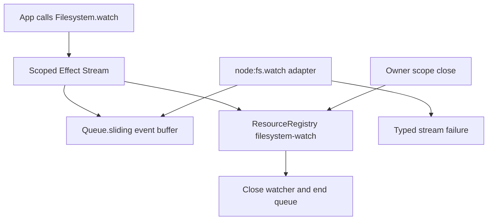

# Watcher subresource: stream of FS events; scope-bound; cleanup on scope close

## What we set out to do

The issue asked for `Filesystem.watch` as a typed stream of filesystem events whose watcher lifetime is bound to an owner scope. The key invariant was not event delivery alone; it was that a long-lived OS watcher becomes a `ResourceRegistry` entry, appears in `Resources.list`, and is disposed both when the stream ends and when the owner scope closes.

## What actually ended up working

The implementation kept the planned shape but made the registry dependency explicit in `makeFilesystem`, so the watcher cannot hide behind a module-global registry. `Filesystem.watch` validates input with schema decoding, acquires a sliding Effect queue, creates the adapter watcher, registers a `filesystem-watch` resource, and routes both normal stream finalization and scope close through `registry.dispose(handle.id)`. Event classification uses `stat` for rename events with a filename, so create/delete are reported as values instead of leaking Node's ambiguous `rename` event.

## What surfaced in review

Two review findings changed the final design. First, `node:fs.watch` can emit asynchronous `error` events after construction; without an error listener, Node treats that as an uncaught exception. The adapter now accepts an `onError` callback and pushes a typed `FilesystemError` into the stream failure channel. Second, `watch` originally dereferenced `options` before schema validation; the implementation now treats missing options as input data and returns a typed `InvalidArgument`.

## First-principles postmortem

The invariant that mattered was "all effectful failure is data." A watcher has one synchronous acquisition boundary and one asynchronous event-emitter boundary; both are part of the same resource lifecycle. Modeling only acquisition errors was a partial contract because the OS can invalidate the watcher later. The correction was to make later errors flow through the same stream channel as event classification failures.

## Game-theory postmortem

The local incentive was to satisfy the visible event and cleanup tests while leaving the less common emitter-error path implicit. That creates a bad equilibrium where rare OS failures crash the process and nobody sees the missing typed boundary until production. The mechanism that improved alignment was review pressure plus tests that exercise untyped caller input and asynchronous adapter failure as first-class cases.

## Non-obvious lesson

Filesystem watcher APIs are not a single Effect acquisition; they are a resource plus a callback protocol with an independent failure path. In Effect-owned code, every callback protocol needs an explicit typed error route, otherwise the system has only moved the throw to a later time.

## Reproducible pattern (if any)

When wrapping an event-emitter API, model both channels up front: data callback and error callback.
Acquire the emitter in `Effect`, register cleanup in the resource owner, and translate later emitter errors into the stream failure channel.
Add one test for invalid construction input and one test for post-acquisition failure.

## AGENTS.md amendment candidate (if any)

When wrapping event-emitter APIs, require tests for both construction-time failure and post-acquisition error events. Why: emitter errors otherwise bypass Effect's typed failure channel and can crash the process after acquisition succeeded.

This is a proposal. Review and edit AGENTS.md yourself if you want to adopt it — `/learn` never auto-edits AGENTS.md.
