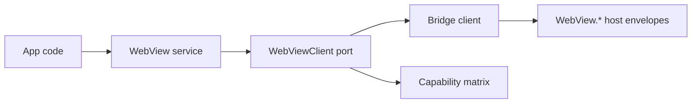

# WebView service deepening - load, navigate, devtools toggle

## What we set out to do

Issue #16 asked for the §11.3 WebView surface: typed navigation, reload/history, screenshot capture, navigation policy replacement, destroy, and runtime capability checks. The host currently owns WRY WebView attachment only as part of window creation, so the implemented slice deliberately shipped the TypeScript service and bridge contract while leaving native host WebView adapters as explicit unsupported behavior.

## What actually ended up working

The PR added `packages/native/src/webview.ts` with schema classes, `WebViewApi`, `WebViewClient`, `WebView`, bridge and service layers, a local capability matrix, and `NavigationBlocked` event decoding. The bridge adapter strips renderer resource proxies back to serializable resource handles before sending host envelopes, because `ApiResourceProxy` carries a `dispose` function that must never cross the host protocol boundary. Unwired host methods fail with typed `HostProtocolUnsupportedError`; capability checks remain available through the local matrix.

## What surfaced in review

One automated review comment was addressed and resolved. The original capability matrix reported `devtools open` as `true` for macOS and Linux even though §11.3 marks those as dev-only. The fix added a typed runtime mode (`"dev" | "prod"`), defaulted capability evaluation to production mode, and made non-Windows devtools support return `false` unless the caller explicitly evaluates in dev mode.

## First-principles postmortem

The invariant was that a capability value must mean "safe to rely on in this runtime context," not merely "the platform has some version of this feature somewhere." A static matrix without runtime mode erased the difference between dev and prod, which would let app code skip unsupported handling in production. The better primitive is capability as `(name, platform, mode) -> boolean`: still simple, but precise enough to preserve the spec.

## Game-theory postmortem

App authors are tempted to treat `true` as permission to use a feature unguarded. If the framework over-reports support, the local shortcut is rewarded and production gets the cost. Defaulting mode-sensitive capabilities to production-safe `false` changes the payoff: code must opt into dev-only assumptions, and tests can prove the distinction. CI also surfaced an unrelated Windows cache failure before repo commands ran; rerunning the job, rather than weakening the gate, preserved the merge invariant.

## Non-obvious lesson

Capability matrices are policy, not documentation. A boolean answer must encode the context that changes whether a feature is actually available, including runtime mode when the spec says "dev-only." Otherwise the API creates a false sense of safety.

## Reproducible pattern (if any)

For capability APIs:

1. Model every axis that changes support as typed input.
2. Default unknown or mode-sensitive support to the production-safe answer.
3. Keep the matrix local and pure until a true host probe exists.
4. Test unsupported and dev-only cases directly.

## AGENTS.md amendment candidate (if any)

Capability checks must include every support-changing axis, and dev-only support must default to `false` unless dev mode is explicit. Why: capability APIs become application guards, so over-reporting support creates production failures.

This is a proposal. Review and edit AGENTS.md yourself if you want to adopt it - `/learn` never auto-edits AGENTS.md.
