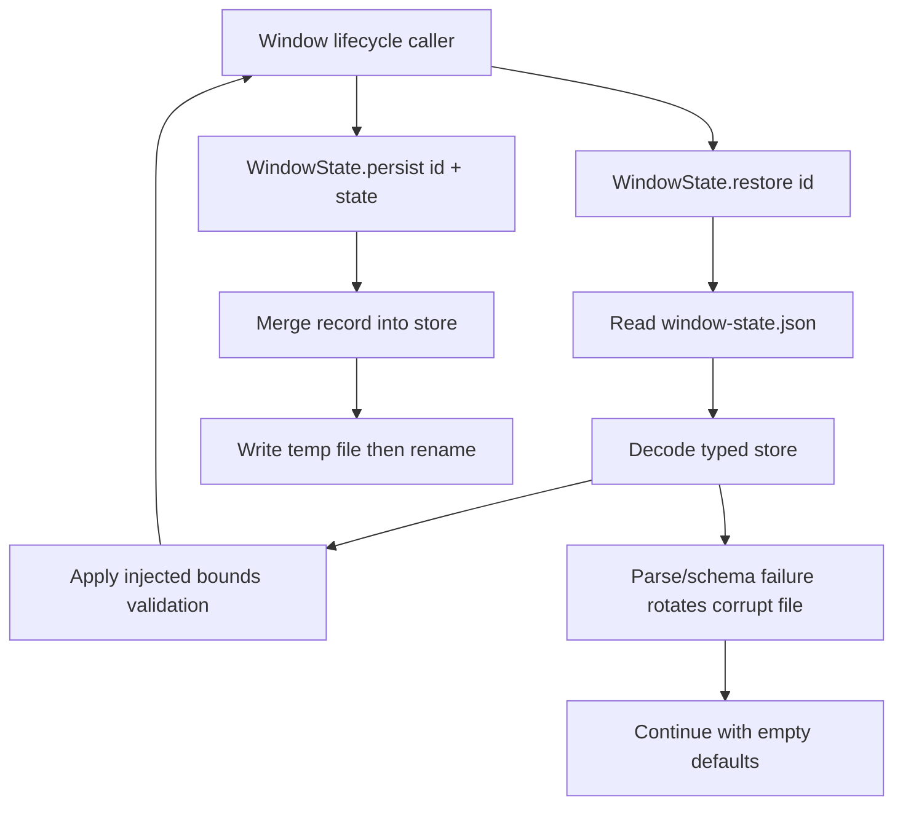

# WindowState runtime primitive (@effect-desktop/core): persist size/position/zoom per window id

## What we set out to do

Issue #132 asked for the core `WindowState` primitive: a per-window durable record for geometry, zoom, devtools panel, and scroll positions stored at the platform window-state path. The invariant was durable, atomic, resilient persistence without wiring future multi-window lifecycle events into this phase.

## What actually ended up working

The shipped shape is a core-only Effect service with `restore(id)` and `persist(id, state)` over a typed `WindowStateRecord`. It resolves the platform path, decodes the JSON store through Effect Schema, validates restored bounds through an injected function, and persists through temp-file plus rename. The architecture shifted away from subscribing to window resize/move/zoom events because that belongs to the later multi-window event-routing issue; this PR establishes the storage primitive and leaves event wiring to the owner of concrete lifecycle events.

## What surfaced in review

Two review comments changed the final design. The first caught that corrupt-file rotation returned a typed failure after a successful rename, contradicting the issue's "continue with defaults" recovery path. The second caught that a broad `WindowStateReadFailed` catch would rotate files for ordinary read I/O errors, which could move healthy files unexpectedly. Both comments were addressed and the threads were resolved.

## First-principles postmortem

The invariant that mattered most was separating file health from file accessibility. A malformed JSON payload is a data-corruption case where rotation plus defaults is the recovery path. A read failure is an operating-system boundary failure and must stay visible as a typed `WindowStateReadFailed`. Using one error tag for both made the first implementation too easy to over-catch.

## Game-theory postmortem

The local incentive was to keep the service surface small by mapping every read-side problem into one failure type. That saved code but pushed ambiguity onto recovery logic, which is where data loss risk appears. The review mechanism forced the implementation to make the corruption boundary explicit: parse/schema failures rotate, read failures propagate. That avoids a bad equilibrium where callers get convenient defaults while the runtime silently relocates valid user state.

## Non-obvious lesson

Typed errors are only useful if the tags preserve the recovery boundary. If a single tag covers both "file cannot be read" and "file content is corrupt," downstream Effect recovery code will eventually catch too much and perform the wrong side effect.

## Reproducible pattern (if any)

When an Effect path performs recovery with a side effect, split the boundary before `catchTag`.
Use one typed failure for transport or I/O access and another for decoded domain invalidity.
Test both the recovery case and the non-recovery failure case.

## AGENTS.md amendment candidate (if any)

Effect recovery handlers must catch the narrowest typed failure that justifies the recovery side effect. Why: broad tags make it easy to turn operational failures into silent state mutation.

This is a proposal. Review and edit AGENTS.md yourself if you want to adopt it — `/learn` never auto-edits AGENTS.md.
