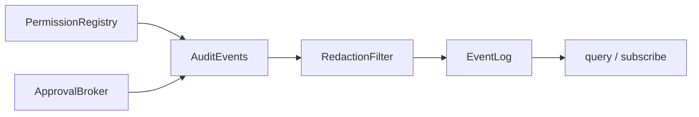

# Audit events for every denial, grant, revocation logged structurally

## What we set out to do

The issue required permission-relevant transitions to become reconstructible from structured, redacted audit rows. The intended shape was a typed `AuditEvents` boundary that records normalized capability, source, actor, resource, trace id, outcome, and timestamp, then persists through `EventLog` with query and stream export.

## What actually ended up working

The implementation made `AuditEvents` a narrow adapter over `EventLog`: it formats closed `audit/<kind>` rows, applies the shared redaction filter before persistence, and exposes `query` and `subscribe` directly over the redacted log rows. `PermissionRegistry` and `ApprovalBroker` now route decisions and lifecycle transitions through this boundary instead of hand-writing separate event payloads. The final event-kind set stayed scoped to services owned by this phase: permission grants, denials, revocations, expiry, consumption, use, and approval request/grant/deny outcomes. File, process, secret, updater, and extension events remain for the services that own those operations.

## What surfaced in review

No PR review comments were posted before merge. The pre-commit review did surface one scope correction: an emit-only audit helper was not enough, because exportability was part of the issue contract. Adding `query` and `subscribe` to `AuditEventsApi` made the export path explicit and testable.

## First-principles postmortem

The invariant was that an incident responder must be able to reconstruct which authority was checked or used without reading service-specific payload formats. A plain append helper centralizes event names, but it does not own the retrieval contract. The deeper module is the one that owns both directions: write structured rows and expose the same redacted rows for replay.

## Game-theory postmortem

The local shortcut is to log "good enough" strings close to the code path that has the context. That optimizes the emitting service but leaves future responders with multiple private dialects and no compile-time pressure to stay structured. A closed audit boundary changes the incentive: privileged services get a small, typed API, while the audit log keeps a stable shape that production checks and incident tooling can consume.

## Non-obvious lesson

Redaction can remove fields that look operationally useful, including grant-shaped tokens. That is correct for the safety boundary, but it means correlation should rely on non-secret event ids, trace ids, actor, resource, and normalized capability rather than secret-bearing handles.

## Reproducible pattern (if any)

When a feature says "emit and export," avoid splitting those verbs across unrelated modules. Put emit, query, and stream on the same typed boundary, then back it with the lower-level log. Tests should assert the persisted/exported row, not just the call into the formatter.

## AGENTS.md amendment candidate (if any)

For audit work, require the owning audit module to expose both write and read paths because incident-response contracts are bidirectional.

This is a proposal. Review and edit AGENTS.md yourself if you want to adopt it - `/learn` never auto-edits AGENTS.md.
