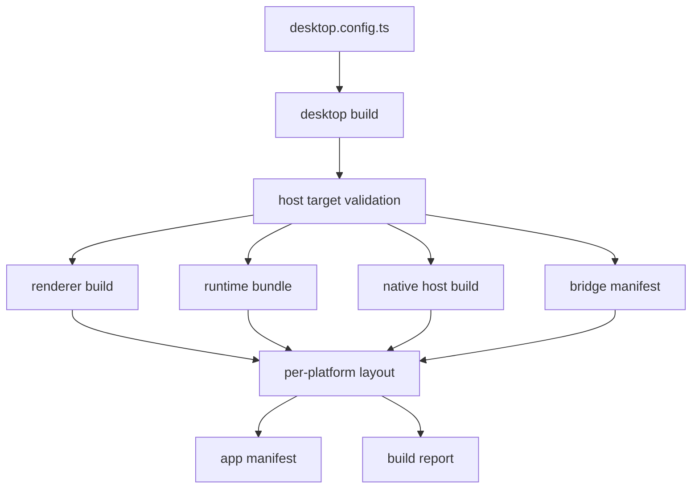

# bun desktop build pipeline

## What we set out to do

Issue #63 asked for one first-party build command that takes a project's `desktop.config.ts`, refuses non-matching platform targets, builds renderer/runtime/native-host artifacts, stages the per-platform layout, and emits the app, bridge, and build-report manifests that later packaging work can consume.

## What actually ended up working

The shipped slice adds `desktop build` behind the existing CLI entry point and keeps every effectful boundary in Effect: config loading, target validation, subprocess execution, file staging, JSON manifest writes, and CLI error reporting all return typed values instead of throwing through the public path. A playground config gives the validation gate and manual smoke command a real app target. The command creates the expected renderer, runtime, native host, bridge manifest, app manifest, and build report layout on the host platform, while unsupported or non-matching targets return `BuildUnsupportedTargetError` with a doctor remediation.

## What surfaced in review

Review surfaced two correctness comments. First, the app manifest writes `runtime/main.js` while `bun build --outdir` derives the output filename from the configured runtime entry; an app using `runtime.ts` or `src/app.ts` can produce a manifest pointing at a missing bundle. Second, missing `runtime.entry` falls back to `packages/core/src/runtime/main.ts`, which can make a misconfigured app build the framework smoke runtime instead of failing loudly. These were known comments at merge time rather than addressed changes.

## First-principles postmortem

The invariant that mattered was artifact truth: the manifest must describe the files actually staged on disk. The first slice proved the command shape and platform gate, but the review comments showed that "a successful build exists" is weaker than "the staged app can start from its manifest." Build systems need explicit source-of-truth edges because a fallback or hardcoded path creates a false success.

## Game-theory postmortem

The local incentive was to get one green build pipeline merged so downstream packaging work had a layout to consume. That incentive helps the project move, but it also rewards a thin happy-path implementation unless review comments force the manifest and config boundaries to be exact. The useful mechanism was CI on Blacksmith across Linux, macOS, and Windows; the missing mechanism was a test that compares manifest paths to staged files for non-`main.ts` runtime entries.

## Non-obvious lesson

A build command's typed error model is only as strong as its manifest model. Returning `BuildConfigError` and `BuildUnsupportedTargetError` as values is necessary, but not sufficient; every generated manifest field must be derived from the build plan or the produced artifact, not from an assumed filename or a convenient default.

## Reproducible pattern (if any)

For every generated manifest path, assert that the referenced file exists in the staged layout.
Treat missing app-owned config fields as `BuildConfigError`, not framework fallback.
Use one real fixture whose filenames differ from defaults so path assumptions fail in tests.

## AGENTS.md amendment candidate (if any)

Generated manifests must be validated against staged artifacts before a build feature is complete. Why: manifest drift creates green builds that fail only when the app starts.

This is a proposal. Review and edit AGENTS.md yourself if you want to adopt it — `/learn` never auto-edits AGENTS.md.
