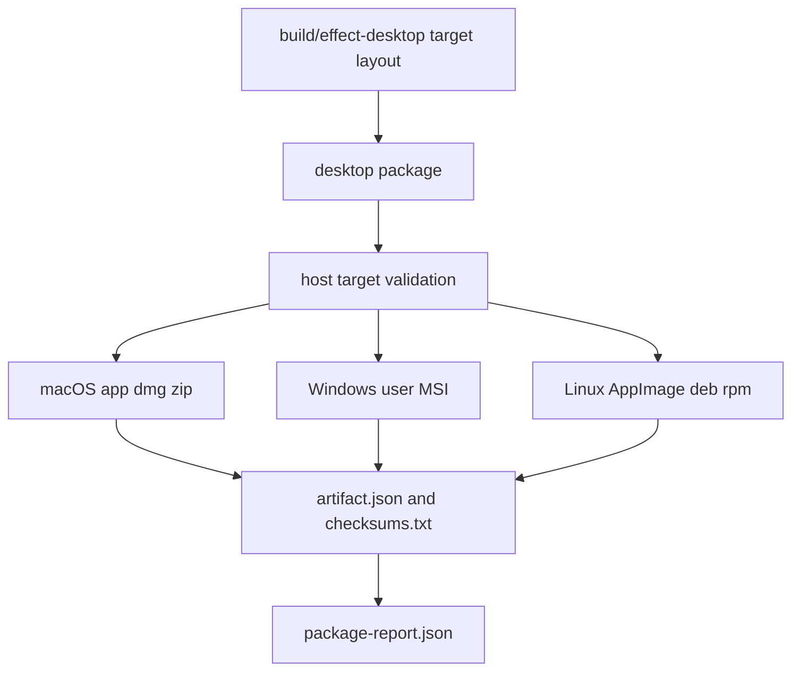

# bun desktop package artifacts

## What we set out to do

Issue #64 asked for a first-party `desktop package` command that consumes the staged layout from `desktop build`, emits only the fixed §23.2 artifact set for the current platform, rejects out-of-scope artifacts such as Windows system-mode MSI, and writes metadata sidecars with size and SHA-256 checksums.

## What actually ended up working

The final shape is a dedicated package pipeline module behind the CLI dispatcher. The module validates the build layout, enforces the host-target rule, maps the target to the exact platform artifact set, runs platform tools through an injectable Effect command runner, and validates each output path before writing `artifact.json`, `checksums.txt`, and `package-report.json`. macOS `.app`, `.dmg`, and `.zip` were exercised against real local tools; Windows and Linux tool paths are covered through deterministic command-runner tests.

## What surfaced in review

Four review threads were addressed and resolved. The first review caught that MSI `UpgradeCode` cannot be a shared constant because every app would belong to the same installer upgrade family. It also caught that RPM `BuildArch` must come from `PackageTarget`, not a hardcoded x86_64 value. A later automated review caught the `rpmbuild` output path assumption: setting only `%_rpmdir` lets default RPM macros place the output under an architecture subdirectory, so the pipeline now pins `%_rpmfilename` to the expected artifact file.

## First-principles postmortem

The invariant is that package metadata is product identity, not decoration. A package command must prove that the artifact exists and that the metadata describes the exact product, architecture, and filename that downstream signing and release stages will consume. Checksums only prove bytes after the fact; they do not repair a wrong installer family or architecture label.

## Game-theory postmortem

The bad local move was hardcoding the common case: one MSI GUID, x64 RPM metadata, and the default RPM output layout. Those choices make tests green for the first app on the first architecture while pushing the cost to release engineers and users later. The corrective mechanism was review focused on repeated future apps and platform cells, plus tests that exercise arm64 and installer identity explicitly instead of treating generated files as opaque.

## Non-obvious lesson

Packaging correctness has two layers: artifact bytes and artifact identity. The second layer is easier to miss because fake runners can create the expected file path, but release tooling relies on identity fields such as MSI upgrade family, RPM architecture, and tool-defined output naming just as much as it relies on checksums.

## Reproducible pattern (if any)

When wrapping a platform packager, pin the output filename instead of assuming the tool's default layout.
Derive installer identity from app identity or require it as explicit config; never share a framework-wide product identity.
For every architecture accepted by the target type, test at least one metadata field that differs by architecture.

## AGENTS.md amendment candidate (if any)

Packaging tests must assert identity metadata, not only output file existence. Why: release artifacts can exist with the wrong installer family, architecture, or tool-resolved filename.

This is a proposal. Review and edit AGENTS.md yourself if you want to adopt it — `/learn` never auto-edits AGENTS.md.
