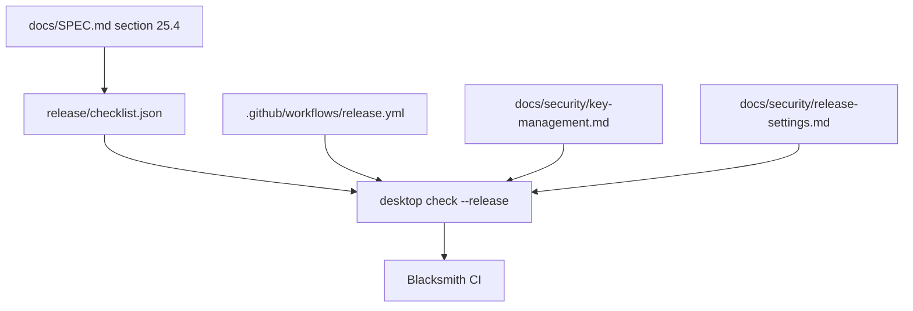

# CI release checklist -- SBOM, CVSS scan, SLSA provenance, HSM signing, secret scanning

## What we set out to do

Issue #124 required the release path to enforce every `docs/SPEC.md` section 25.4 supply-chain gate: SPDX SBOM generation, CVSS blocking, reproducible builds, SLSA provenance, HSM-backed signing, secret scanning, ephemeral runners, and branch protection. The intended invariant was that a release either carries an observable chain of custody or does not ship.

## What actually ended up working

The implementation split the release posture into one manifest, one typed Effect verifier, one release workflow, and two security policy documents. `release/checklist.json` records the exact section 25.4 gate ids, `desktop check --release` validates that each gate has concrete workflow or policy evidence, `.github/workflows/release.yml` wires the release-only SBOM, CVSS, reproducibility, SLSA, and HSM-signing posture steps on Blacksmith runners, and CI runs the verifier on every branch push and PR. Repository settings that cannot be truthfully enforced from workflow YAML are captured in `docs/security/release-settings.md` and checked as explicit evidence.

## What surfaced in review

There were no external review comments. The local review pass tightened two facts before the PR opened: the release verifier rejects unpinned actions by inspecting every `uses:` line for a SHA, and it rejects stale checklist evidence instead of trusting a gate id alone. The other important review constraint was honesty: secret scanning and branch protection are repository settings, so the file-based gate verifies the checked policy statement and leaves the actual setting enforcement to GitHub.

## First-principles postmortem

The core invariant was provenance, not workflow volume. A long release workflow can still be unsafe if its steps are unpinned, detached from the spec, or only assert policy in comments. Binding the spec gate ids to evidence paths and token-level workflow checks makes the cheapest passing change preserve the promised release posture.

## Game-theory postmortem

The friction came from a mismatch between local control and external authority. CI YAML can run SBOM and CVSS tools, but it cannot prove a repository has branch protection or secret scanning enabled. Pretending otherwise would create a bad equilibrium where contributors satisfy review with decorative configuration. The better mechanism is to separate enforceable workflow facts from repository-setting attestations and make the weaker evidence visible in a checked policy document.

## Non-obvious lesson

Supply-chain gates need evidence classes. Workflow-enforceable gates can be checked mechanically from release YAML; repository-owned gates need an explicit policy artifact and a separate operational setting. Treating both as the same kind of file check hides the real risk boundary.

## Reproducible pattern (if any)

Encode spec-enumerated release gates in a manifest with exact ids and evidence references.
Implement the verifier as an Effect program with typed file, manifest, and evidence errors.
Add negative tests for stale evidence, missing required gate ids, unpinned actions, and forbidden signing posture.
Document repository settings separately when source control cannot enforce them directly.

## AGENTS.md amendment candidate (if any)

When a release gate depends on repository settings outside source control, add a checked policy artifact and state that the real enforcement remains a GitHub setting. Why: workflow YAML cannot honestly prove branch protection, secret scanning, or reviewer rules.

This is a proposal. Review and edit AGENTS.md yourself if you want to adopt it -- `/learn` never auto-edits AGENTS.md.
