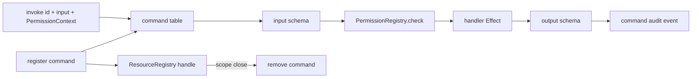

# CommandRegistry Effect service: register command with id, schema, handler, capability

## What we set out to do

Issue #67 set out to create one typed command registration and invocation path so menus, shortcuts, renderer actions, and later devtools surfaces do not each grow their own handler, permission check, and audit call. The invariant was that command invocation validates input, applies the declared capability, runs one handler, validates output, and cleans registration up with the owner scope.

## What actually ended up working

The shipped shape is a `CommandRegistry` Effect service in `@effect-desktop/core`, backed by a Ref-owned command table, `ResourceRegistry` cleanup, and `PermissionRegistry` checks. The architecture changed in one important way: `invoke` takes an explicit `PermissionContext`, because the existing permission model requires an actor and trace context to decide and audit authority. Registration returns a scope-owned `ResourceHandle<"command", "registered">`, and scope close unregisters the command through the resource disposer.

## What surfaced in review

Automated review caught three boundary issues. First, registration reserved the command id before the resource handle was registered, so an interrupted fiber could leave a command in the table without a disposer; the final shape wraps registration in an Effect finalizer that removes the reserved command when no handle exists, or disposes the resource when a handle was created but registration did not finish. Second, `invoke` mapped handler failures in the error channel but did not catch synchronous handler throws or Effect defects; command handlers are now invoked through an Effect boundary that returns `CommandRegistryHandlerFailureError` for all three handler failure modes. Third, command invocation audit rows now use the permission grant trace id so they correlate with permission-granted and permission-used audit rows. The local review also checked the main architecture risk: avoiding an ambient or default actor. The PR kept the actor explicit in `invoke`, and the tests cover success, duplicate registration, missing command, invalid input before permission and handler effects, permission denial, handler failure, handler defects, output validation, trace correlation, scope cleanup, and interrupted registration rollback.

## First-principles postmortem

The registry is not just a map from strings to callbacks. It is the authority boundary for command actuation. That means the command id, schemas, capability, actor context, handler, audit, and lifecycle cleanup are one invariant, not optional conveniences for each caller to remember.

## Game-theory postmortem

The tempting local move is to make command invocation easy by hiding actor context or letting menu/shortcut code call handlers directly. That would recreate the original bad equilibrium: each actuation surface owns a partial security story. Requiring `PermissionContext` and capability at the registry boundary makes the correct move cheap and makes bypasses visible in review.

## Non-obvious lesson

A command registry without explicit actor context becomes a permission bypass pressure point. The registry cannot safely invent an actor, use a default actor, or rely on ambient state, because the permission decision and audit row are only meaningful when the principal is named at invocation time.

## Reproducible pattern (if any)

When a shared runtime service centralizes actuation:

- Require the authority context at the call boundary.
- Validate caller input before permission and handler side effects.
- Wrap caller-provided handlers as an Effect boundary: synchronous throws, failed Effects, and defects become typed failures.
- Reuse the permission grant trace id for downstream audit emitted by the same invocation.
- Keep resource cleanup and table cleanup in one disposer.
- Add rollback finalizers around multi-step registration so interruption cannot strand partial state.
- Treat audit failure during registration as failed registration and clean up the reserved resource.

## AGENTS.md amendment candidate (if any)

Shared actuation services must require explicit actor or authority context at invocation. Why: default or ambient principals turn centralization into a permission bypass.

This is a proposal. Review and edit AGENTS.md yourself if you want to adopt it — `/learn` never auto-edits AGENTS.md.
