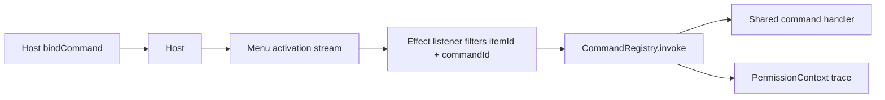

# ContextMenu invokes CommandRegistry so menu and shortcut share a handler

## What we set out to do

The issue wanted context-menu and application-menu item activation to stop relying on per-item callback wiring and route through `CommandRegistry` by `commandId`. The intended invariant was that menu clicks, shortcuts, and bridge calls share one registered handler path with schema validation, permission checks, audit, and trace context.

## What actually ended up working

The existing native menu shapes already carried `commandId`; the missing piece was the Effect-side binding between host activation events and `CommandRegistry.invoke`. `Menu.bindCommand` and `ContextMenu.bindCommand` now call the host `bindCommand` port, start a filtered activation listener, invoke the matching registered command with a `PermissionContext`, and register that listener as a `ResourceRegistry` handle. The architecture shifted from "host emits and runtime routes" to "service owns the listener and runtime invoke" because the current codebase exposes activation as streams rather than a central native menu router.

## What surfaced in review

Local review found no blocking defect. The main review pressure was lifecycle honesty: the host binding has no unbind port, so the implementation can only dispose the Effect listener. The code keeps that boundary explicit by returning a registered resource handle for the listener and not pretending to roll back host state that the current port cannot undo.

## First-principles postmortem

The invariant that mattered most was "a command activation is a request to the command registry, not a direct callback." The assumption that changed was where routing should live: the issue described a runtime route after a host event, but the existing module boundary made the `Menu` and `ContextMenu` services the narrowest correct place to own that stream subscription. Typed failure handling also mattered: command invocation failures are values logged per event, while host stream failures stay in the listener fiber's error channel.

## Game-theory postmortem

Menu authors have a local incentive to attach a closure close to the UI definition because it is immediate and easy. That creates a bad equilibrium where shortcuts, menus, and bridge calls drift into separate handlers with different permission behavior. The mechanism that improves alignment is a single `commandId` surface: authors bind UI affordances to a command identity, and the registry owns validation, permission, audit, and handler execution. The missing information early was that current host bindings are one-way. Future review should check whether a binding API has both bind and unbind before promising complete lifecycle rollback.

## Non-obvious lesson

When a binding starts a long-lived Effect listener after a host-side bind, the listener needs its own resource handle even if the host binding has no unbind operation. Otherwise a failed registration or abandoned caller leaves invisible work running. The correct minimum is to interrupt the listener on registration failure and expose the listener handle for later disposal, while documenting that host unbind requires a future port.

## Reproducible pattern (if any)

For UI affordance to command routing:

1. Keep the UI identity (`itemId`, accelerator, target) separate from the command identity (`commandId`).
2. Bind the host affordance first, then start a filtered Effect listener.
3. Invoke `CommandRegistry` with a concrete `PermissionContext`.
4. Catch command failures per activation so one bad handler does not kill the listener.
5. Register the listener in `ResourceRegistry` and interrupt it if registration fails.

## AGENTS.md amendment candidate (if any)

When adding a bind-style native API, require an explicit answer for the unbind/disposal path; Why: one-way host bindings force weaker lifecycle guarantees than Effect listener disposal can provide.

This is a proposal. Review and edit AGENTS.md yourself if you want to adopt it -- `/learn` never auto-edits AGENTS.md.
