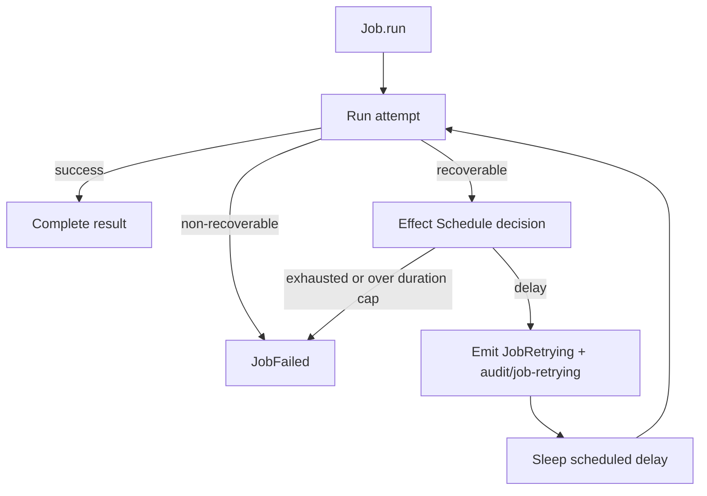

# Crash and retry policy via Effect Schedule for jobs

## What we set out to do

Issue #92 asked for declarative retry on `Job`: app authors should pass an
Effect `Schedule`-backed policy instead of writing retry loops, retries should
be jittered and capped, each retry should be observable, non-recoverable
permission and capability failures should bypass retry, and exhaustion should
return `JobFailed` with attempts and the last typed failure.

## What actually ended up working

The implementation kept retry inside the `Job` state machine rather than making
callers compose their own loop around `Job.run`. `CrashRetryPolicy` exports
named constructors for exponential jittered, fixed, and once-per-minute
schedules, each with a max retry count, optional max total duration, and a
recoverability predicate. `Job.run` still owns the managed fiber, timeout,
cancel, status, result, replay log, progress bus, and resource cleanup; retry
now sits inside that ownership boundary so every attempt updates the same typed
result and progress surface.

## What surfaced in review

No review comments were posted before merge. The main pre-merge adjustment came
from re-reading the issue against the diff: the first implementation capped
retry count but not total retry duration. Adding `maxTotalDuration` to the
policy made the implementation match the issue text and added a regression test
for duration-based exhaustion.

## First-principles postmortem

The invariant was that retry is part of job lifecycle, not caller control flow.
Once a job exists, its status, result, audit trail, progress stream, timeout,
and cancellation must describe one coherent state machine. The important
assumption that changed was where schedule interpretation belongs: Effect owns
the schedule math, but `Job` owns the domain transition around each schedule
step because only `Job` can emit typed progress and audit events in the right
order.

## Game-theory postmortem

The bad equilibrium was every app team writing local retry loops that optimize
for getting past a transient failure while hiding backoff, attempt count, and
incident signal from operators. The mechanism that improves alignment is a
single typed retry policy with observable retry events and default
non-recoverable classification for permission and capability failures. App
authors get less code and operators get explicit retry telemetry instead of
silent re-execution.

## Non-obvious lesson

Effect `Schedule` is the right primitive for delay decisions, but it is not the
whole retry subsystem. A runtime service still needs to own the state machine
around each scheduled retry so cancellation, timeout, audit failure, progress
fanout, and final `JobFailed` values stay consistent.

## Reproducible pattern (if any)

Use Effect primitives for policy math and service-local state machines for
domain transitions.
Emit retry telemetry before sleeping, not after waking.
Treat audit emission failure as a typed service failure when an audit store is
explicitly supplied.

## AGENTS.md amendment candidate (if any)

Runtime retry features should keep Effect `Schedule` at the policy boundary and
own retry observability inside the service state machine. Why: caller-side retry
loops hide lifecycle transitions from status, audit, and progress consumers.

This is a proposal. Review and edit AGENTS.md yourself if you want to adopt it
-- `/learn` never auto-edits AGENTS.md.
