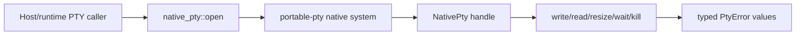

# crates/native-pty cross-platform PTY primitive

## What we set out to do

Issue #123 asked for the Rust PTY primitive that later TypeScript Effect services can consume: open a pseudo-terminal, write bytes, read output, resize, wait, kill, map failures into a closed error surface, and keep per-platform PTY behavior out of application code.

## What actually ended up working

The shipped shape is a narrow `crates/native-pty` Rust API over `portable-pty`: `open(PtySize, PtyCommand)` returns a `NativePty` handle with `write`, `read`, `resize`, `try_wait`, `wait`, `kill`, and `process_id`. The implementation validates arguments before side effects, catches panics at each public operation, maps platform errors into `PtyError` values, and keeps TypeScript service policy, stream backpressure, and process-tree semantics out of this crate. `portable-pty` became the right abstraction boundary: it already owns POSIX and Windows PTY divergence, so direct winpty/conpty wiring here would have duplicated the dependency's job.

## What surfaced in review

One P1 review finding changed the final design. After `spawn_command` succeeded, failures in `try_clone_reader` or `take_writer` returned `Err` without terminating the already-spawned child. The fix made setup failure cleanup explicit: if stream handle construction fails after spawn, `open_inner` kills and waits for the child before returning the typed `PtyError`. No pushback or escalation was needed.

## First-principles postmortem

The invariant was simple: a failed `open` must not create an unowned process. A PTY child is a resource with time and side effects, so ownership starts the moment `spawn_command` returns, not when the final `NativePty` struct is assembled. The design became correct when construction was treated as a transaction: validate first, acquire resources in order, and compensate immediately if a later acquisition fails.

## Game-theory postmortem

The local incentive was to keep the happy-path constructor compact and rely on `Drop` once the handle exists. That misses the information asymmetry between the constructor and the caller: the caller cannot clean up a child for an `Err` return because no handle was returned. The review mechanism aligned the code with the production invariant by forcing the constructor to own cleanup for every partial-acquisition state.

## Non-obvious lesson

PTY setup has two different hard parts: platform behavior and resource ownership. `portable-pty` can hide platform behavior, but it cannot decide this crate's ownership contract. The crate still has to treat every post-spawn setup step as fallible and return errors as values only after cleaning up resources the caller cannot see.

## Reproducible pattern (if any)

For constructors that acquire external resources in stages:

1. Validate pure inputs before side effects.
2. Treat the first successful external acquisition as ownership transfer into the constructor.
3. If a later acquisition fails before the public handle exists, explicitly release every earlier resource.
4. Return the typed error only after the partial resource graph is cleaned up.

## AGENTS.md amendment candidate (if any)

For native resource constructors, require a partial-acquisition cleanup check before merge; Why: a typed `Err` is not safe if it strands resources the caller never received.

This is a proposal. Review and edit AGENTS.md yourself if you want to adopt it -- `/learn` never auto-edits AGENTS.md.
