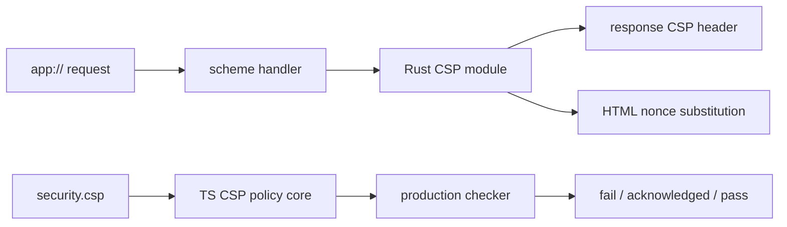

# CSP defaults wired to renderer header pipeline with weakening acknowledgement

## What we set out to do

Issue #46 asked for the §14.7 production CSP to stay under host response-header control, with fresh nonces on `app://` responses and config-level tightening allowed while weakening still requires explicit acknowledgement and production-checker visibility.

## What actually ended up working

The final shape split the problem across the two real authorities. The Rust host owns response-time nonce minting and CSP header rendering through a focused `csp` module used by the `app://` scheme handler. The TypeScript config package owns the policy model used by `desktop check --production`: default directives, nonce placeholder rendering, effective policy rendering, duplicate directive detection, tightening additions, and weakening classification.

## What surfaced in review

Three comments were addressed. Local review found that treating every directive outside the default list as a weakening would reject valid hardening such as `frame-src 'none'` and normalize acknowledgement noise. External review found two false negatives: duplicate CSP directives could overwrite an earlier unsafe directive in the parser, and static nonce values were being treated as equivalent to the per-request `{N}` placeholder.

## First-principles postmortem

The invariant is not string equality with the default CSP. The invariant is "no additional browser authority without acknowledgement." That means the checker has to understand enough CSP structure to distinguish authority expansion, harmless hardening, malformed duplicate directives, and per-request nonce semantics.

## Game-theory postmortem

The local shortcut is to treat CSP as a string or a map because that is easy to test. That creates two bad equilibria: safe hardening gets forced into acknowledgements, making exceptions noisy, and malformed or static-nonce policies can slip through because the checker accepts the last parsed value. The better mechanism is conservative structural parsing with explicit false-negative tests for browser interpretation traps.

## Non-obvious lesson

CSP comparison is a security parser, not generic config merging. Duplicate directives and nonce values carry browser semantics, so a checker that only compares source-list sets can both reject safe hardening and miss real weakening.

## Reproducible pattern (if any)

Keep response-time nonce generation in the host.
Use `{N}` as the only accepted config placeholder for per-request nonces.
Reject duplicate directives as weakening, even when the last value looks safe.
Allow hardening-only additions without acknowledgement so exceptions stay meaningful.

## AGENTS.md amendment candidate (if any)

When implementing security-policy comparison, model parser edge cases that browser engines interpret specially, including duplicate directives and nonce semantics. Why: string or map normalization can erase the exact information the security gate must preserve.

This is a proposal. Review and edit AGENTS.md yourself if you want to adopt it - `/learn` never auto-edits AGENTS.md.
