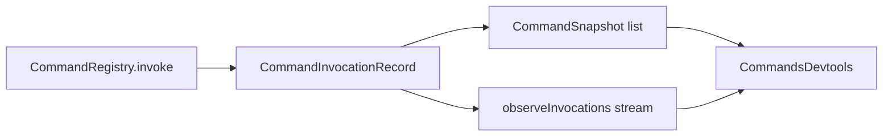

# Devtools surface listing every registered command with capability and last invocation

## What we set out to do

The issue wanted command debugging to stop depending on ad hoc logs. A developer should be able to inspect registered command ids, capabilities, invocation counts, last invocation, and last error from a devtools surface without gaining the authority to invoke or mutate commands.

## What actually ended up working

The shipped shape puts the command read model in `CommandRegistry`, not in devtools. `CommandRegistry.invoke` now records a `CommandInvocationRecord` for success and typed failure paths, updates each registered command snapshot with invocation count, last invocation, and last error, and publishes a live `observeInvocations()` stream. `@effect-desktop/devtools` exposes `CommandsDevtools` as a thin read-only projection over that registry. The architecture shifted from a literal panel/transport implementation to a Phase 17 service projection because the devtools package is still pre-transport, while the registry already owns the source of truth.

## What surfaced in review

Local review found no blocking defects. The main scope check was authority: devtools must not gain command invocation power while implementing observability. The implementation keeps `CommandsDevtools` read-only and leaves panel transport, production devtools enablement, and UI rendering to later devtools phases.

## First-principles postmortem

The invariant was "observability must report the same command state the runtime uses to execute commands." Reconstructing command state from audit rows or a devtools-side cache would create a second source of truth and eventually drift. Recording invocation metadata at the `invoke` boundary is the smaller model: the registry already sees the command id, actor, trace id, duration, success, and typed failure tag.

## Game-theory postmortem

The local shortcut for a developer chasing command bugs is to scatter `console.log` calls or add debug-only branches near shortcuts and menus. That rewards drift because each affordance starts reporting a different version of command truth. The mechanism that changes the payoff is a registry-owned read model: every caller path updates the same snapshot and stream, and devtools can inspect without modifying command behavior. Future reviewers should check that diagnostics read from the owner of the invariant instead of inventing parallel telemetry stores.

## Non-obvious lesson

Devtools should project owner-owned state, not own its own copy of state. For commands, the owner is `CommandRegistry`, so invocation count and last-error metadata belong beside `invoke`; the devtools package should stay a narrow read-only adapter until a real transport/panel layer exists.

## Reproducible pattern (if any)

For runtime devtools surfaces:

1. Put the live read model in the runtime service that owns the invariant.
2. Expose list and observe methods as typed Effect values/streams.
3. Keep devtools projections read-only unless the issue explicitly grants authority.
4. Do not emit secret-bearing inputs when a summary record is enough.

## AGENTS.md amendment candidate (if any)

When adding a devtools surface, first identify the service that owns the observed invariant and add the read model there; Why: devtools-side caches create a second source of truth that drifts from runtime behavior.

This is a proposal. Review and edit AGENTS.md yourself if you want to adopt it -- `/learn` never auto-edits AGENTS.md.
