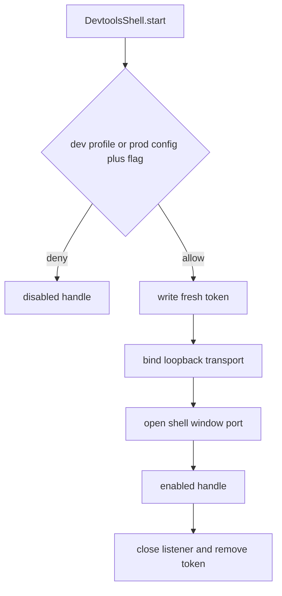

# Devtools shell window and dev-only loopback transport

## What we set out to do

Issue #18 set out to make the devtools surface owned by the framework lifecycle: disabled in production unless both `--devtools` and `security.devtoolsInProd` agree, bound to loopback only, authenticated by a fresh per-launch token in the user's state directory, and revocable through `Devtools.disable()`.

## What actually ended up working

The shipped shape keeps the shell lifecycle in one Effect-owned module. `DevtoolsShell.start` decodes input, applies the dev/prod gate, writes a 256-bit token, binds `127.0.0.1`, opens a shell through an explicit `DevtoolsShellWindow` port, and returns a handle whose `disable` closes the listener and removes the token. The production checker records `security.devtoolsInProd` as an acknowledged diagnostic state because the config bit alone is not enough to start the listener.

## What surfaced in review

There were no PR review comments before merge. Local review still changed the design: the initial default shell-window port was a no-op, which would have made missing native shell wiring look successful. It was replaced with `UnavailableDevtoolsShellWindow`, which fails as `DevtoolsShellOpenError` and cleans up the listener and token path.

## First-principles postmortem

The invariant was that production must have no observable devtools listener unless two independent gates agree. The narrower lesson is that every privileged boundary needs a real port, not a quiet default. A loopback listener is still an exposed surface; if the shell window cannot be opened, the correct state is a typed failure plus cleanup, not a successful handle.

## Game-theory postmortem

The bad local incentive is to make framework services easy to instantiate in tests by giving every port a no-op default. That shifts risk to production because missing wiring becomes invisible. The better mechanism is a failing default at privileged I/O boundaries, with tests opting into fake ports explicitly. That makes the cheapest path for contributors also the path that preserves the security invariant.

## Non-obvious lesson

File permission verification is platform-shaped. The service should still request `0600` for the token file, but Windows does not report POSIX mode bits the same way; asserting exact mode cross-platform produced a false CI failure. The invariant should be tested directly on POSIX and separately through lifecycle behavior everywhere.

## Reproducible pattern (if any)

Privileged service default ports should fail with typed Effect errors.
Tests should provide fake ports explicitly.
POSIX-only filesystem invariants should be guarded by platform checks.
Lifecycle cleanup should be asserted on both success and failure paths.

## AGENTS.md amendment candidate (if any)

When a service owns a privileged I/O boundary, its default port should fail loudly as a typed Effect error rather than silently no-oping; Why: missing production wiring must not look like a successful secure startup.

This is a proposal. Review and edit AGENTS.md yourself if you want to adopt it -- `/learn` never auto-edits AGENTS.md.
