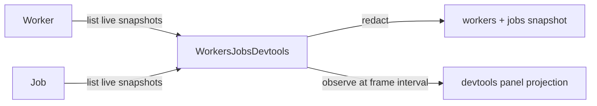

# Devtools surface for live workers and jobs

## What we set out to do

Issue #93 asked for the minimum devtools visibility for Phase 18 runtime work:
workers and jobs should be visible with status, ownership, capability/progress
data, errors where available, and redaction before display. Phase 19 owns the
full devtools UI and transport, so this cycle had to ship a useful projection
without inventing that larger surface early.

## What actually ended up working

The shipped shape follows the existing `CommandsDevtools` pattern: devtools is
an Effect projection package over core runtime services. `Worker` gained a
`list()` source-of-truth API with live snapshots for id, script, owner scope,
resource id, status, uptime, and capabilities. `WorkersJobsDevtools` combines
`Worker.list()` and `Job.list()`, redacts the aggregate snapshot, and exposes
`observe()` as an initial snapshot plus frame-interval refresh for the future
panel.

## What surfaced in review

Codex posted one P2 finding and it changed the implementation. `Worker.list()`
computed `uptimeMs` from the injected clock and then constructed a
`WorkerSnapshot` whose schema requires an integer. A fractional clock such as
`performance.now()` could have produced a schema defect in an API typed as
`never` failing. The fix floors the uptime before snapshot construction and adds
a regression test with a fractional injected clock.

## First-principles postmortem

The invariant was that devtools projections cannot be more authoritative than
the runtime services they inspect. The first missing fact was not a panel; it
was that `Worker` had no snapshot API comparable to `Job.list()`. Once that fact
existed in core, devtools could stay thin and read-only. The review finding
clarified a second invariant: schema construction inside a `never`-failing
Effect path must normalize externally supplied values before constructing the
schema class.

## Game-theory postmortem

The local shortcut was to infer worker state from `ResourceRegistry` because the
registry already knows live resources. That would make devtools easy today but
globally weak: resource handles do not know worker scripts, capabilities, or
worker-specific lifecycle facts. The better mechanism is to make `Worker` own
its own devtools-readable facts and make the devtools package only project them.
The review also exposed a deadline-pressure failure mode where a type says
`never` while an injected dependency can still make construction throw.

## Non-obvious lesson

Effect services that expose schema-class snapshots must treat injected clocks
and other test seams as untrusted inputs. If the service advertises `never` in
the error channel, normalize those values before constructing the class so
schema validation cannot become an untyped defect.

## Reproducible pattern (if any)

Put runtime-specific snapshot facts on the runtime service, not on
`ResourceRegistry`.
Keep devtools services as read-only projections over core sources of truth.
Normalize injected numeric values before constructing integer schema classes.

## AGENTS.md amendment candidate (if any)

Services with `never`-failing snapshot APIs must normalize injected clock values
before constructing schema classes. Why: test seams such as `performance.now()`
can otherwise turn validation into an untyped defect.

This is a proposal. Review and edit AGENTS.md yourself if you want to adopt it
-- `/learn` never auto-edits AGENTS.md.
