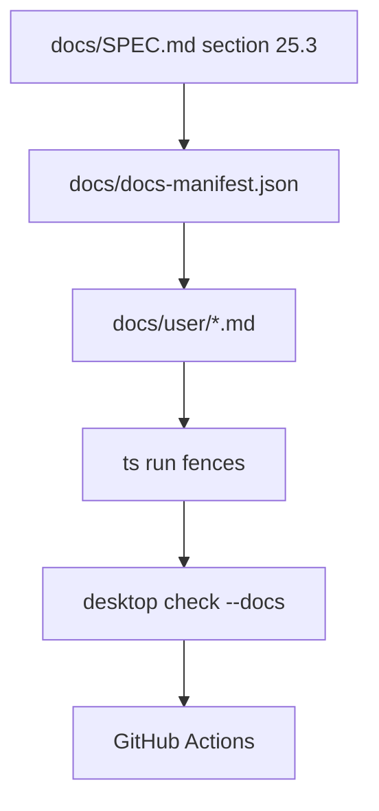

# Documentation release checklist

## What we set out to do

Issue #122 required a release gate for the 24 documentation surfaces listed in `docs/SPEC.md` section 25.3. The intended invariant was not just that docs exist, but that every required primitive has a page and every runnable example is executed so code and docs cannot drift silently.

## What actually ended up working

The implementation added `docs/docs-manifest.json` as the docs surface source of truth, 24 `docs/user/*.md` pages, and `desktop check --docs` as the CLI gate. The CLI reads the manifest, validates the canonical section 25.3 page ids and paths, checks that each page is non-empty, extracts fenced blocks tagged `run`, and executes each example with Bun. The PR also wires the gate into CI beside the public API snapshot check.

## What surfaced in review

There were no external review findings. The local review pass found one correctness issue before merge: checking only that the production manifest had 24 rows preserved the count but not the identity of the required pages. The fix made the gate validate the exact section 25.3 ids and paths and added a regression test where 24 wrong rows still fail.

## First-principles postmortem

The core invariant was identity, not quantity. A release checklist only protects users if it binds the promised docs surfaces to canonical names and paths. Count-only validation proved that a weak metric can preserve the appearance of coverage while losing the thing users depend on.

## Game-theory postmortem

The risky local move was making the easy check cheap: "there are 24 pages" is simpler than "these are the 24 promised pages." That creates a bad equilibrium where future contributors can satisfy CI with placeholders that do not match the spec. Binding the manifest to canonical ids and paths changes the incentive: the cheapest passing move is now to update the promised doc page, not to add any page.

## Non-obvious lesson

A release gate must validate the named promise, not a proxy metric. For documentation coverage, page count is a proxy; canonical page identity is the promise.

## Reproducible pattern (if any)

When a spec enumerates required surfaces, encode the exact ids and paths in the gate.
Add a negative test where the aggregate count is correct but the identities are wrong.
Keep runnable examples in temporary files and map runner failures into typed Effect errors.

## AGENTS.md amendment candidate (if any)

When adding release gates for spec-enumerated artifacts, validate the canonical artifact identities rather than only counts. Why: aggregate counts can pass while the promised surface silently changes.

This is a proposal. Review and edit AGENTS.md yourself if you want to adopt it — `/learn` never auto-edits AGENTS.md.
