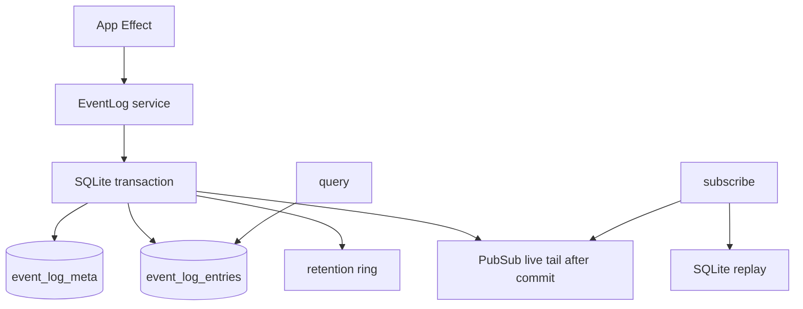

# EventLog service — append-only ring with retention policy

## What we set out to do

The issue asked for an Effect-owned EventLog service with monotonic event ids, durable append, ordered query, live subscribe, retention, disk-full read-only behavior, and corruption handling. The original architecture described rotated SQLite segments, batch flush thresholds, immutable old segments, and quarantine of corrupt segments.

## What actually ended up working

The shipped module is a SQLite-backed retention ring instead of a full segment engine. It keeps the externally important contract narrow: `open`, `append`, `query`, `subscribe`, and `close`, all returning typed Effect values. The implementation stores events in one SQLite table, allocates ids transactionally from per-namespace metadata, uses `PRAGMA synchronous = FULL`, trims old rows by `maxEvents`, and publishes live events only after the transaction commits. That is smaller and more honest than pretending the current SQLite adapter can provide file-level segment rotation, batch fsync, or quarantine semantics it does not expose.

## What surfaced in review

Review produced five addressable comments and no pushbacks. Three P1 findings changed the final design: `subscribe` had to attach its live PubSub subscription before the replay query to avoid dropping events between replay and tail, live events had to be filtered past the replay high-water mark to avoid duplicates, and `SQLITE_FULL` had to transition the log into read-only state instead of merely returning one typed error. Two P2 findings changed stream and persistence semantics: default `subscribe()` now starts at the live tail instead of replaying the whole log, and the log uses a `payload_present` column so explicit JSON `null` survives replay separately from an absent payload.

## First-principles postmortem

The invariant that mattered most was not "events are queryable"; it was "an acknowledged event has exactly one place in the ordered history, and every cursor-based reader can observe it." That made the replay/live boundary a protocol, not a formatting detail. The assumption that changed was that JSON alone could represent optional payload semantics. It cannot distinguish "field absent" from "field present with null" once the API uses optional object fields, so persistence needs explicit presence metadata.

## Game-theory postmortem

The local incentive was to satisfy the issue by naming options and errors from the larger spec, even where the current storage primitive could not honestly implement all of them. The better mechanism was the locked architecture's scope reduction: ship the durable SQLite ring and document the deferred segment engine instead of creating surface area that claims stronger guarantees than it can prove. Review then aligned the implementation with the real reader and operator incentives: no lost tail events, no retry storm after disk full, and no silent mutation of audit payloads.

## Non-obvious lesson

Replay plus live tail is a handshake. The consumer must attach to the live source before taking the durable snapshot, then filter the live stream past the replay high-water mark, or there is either a gap where committed events land in neither source or a duplicate where events appended during replay appear in both sources. The same principle applies to any Effect stream that combines durable replay with a live PubSub channel.

## Reproducible pattern (if any)

For replay-and-tail streams:

1. Decode the cursor as a typed value.
2. Subscribe to the live channel inside the stream scope.
3. Query durable replay after the subscription exists.
4. Compute the replay high-water mark.
5. Concatenate replay with live events whose id is above that high-water mark.

For optional persisted data, store a presence bit when the API must distinguish absent from explicit `null`.

## AGENTS.md amendment candidate (if any)

For durable replay-plus-live streams, subscribe before snapshot and filter the live tail past the replay high-water mark. Why: querying first creates a lost-event window, while subscribing first without a high-water filter creates duplicate delivery.

This is a proposal. Review and edit AGENTS.md yourself if you want to adopt it — `/learn` never auto-edits AGENTS.md.
