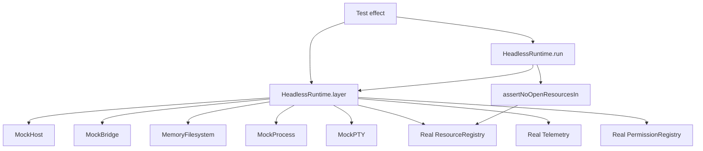

# Headless runtime Effect Layer composing the mocks for CI

## What we set out to do

Issue #39 asked for one test entry point that composes the mock host, mock bridge, memory filesystem, mock process, mock PTY, and the real registry, telemetry, and permission registry. The goal was to make CI and local tests run the same Effect program without hand-wiring every mock or silently skipping resource leak detection.

## What actually ended up working

The stable shape is two entry points over the same composition. `HeadlessRuntime.layer(options)` provides the shared service graph for ordinary `Effect.provide` tests. `HeadlessRuntime.run(effect, options)` builds the same service graph around one registry instance, runs the effect, then checks that registry for leaked resources as a typed `ResourceLeakError`. The implementation kept the composition in `packages/test`, reused the existing mock factories, and did not add a second resource model.

## What surfaced in review

There were no PR review threads, comments, or pushbacks before the learning commit. The implementation review happened through local typecheck: an attempted layer-finalizer approach exposed that Effect finalizers cannot fail typed, and an explicit return type on `HeadlessRuntime.run` initially preserved the caller's full environment instead of subtracting the services supplied by the layer.

## First-principles postmortem

The invariant was that leaks must be returned as values, not thrown or hidden in finalizers. A `Layer` provides services and owns resource finalization, but its finalizers are not a typed error reporting channel. The source of truth is the real `ResourceRegistry`; the runner can inspect it after the test effect exits and return `ResourceLeakError` in the normal Effect error channel.

## Game-theory postmortem

The bad equilibrium was a convenient one-import layer that made setup easy while leaving leak checks optional or untyped. Test authors would adopt the easy API and skip the mechanism that protects later phases. Splitting the API gives each player a clean incentive: use `HeadlessRuntime.layer` when composition is enough, and use `HeadlessRuntime.run` when the test wants the stronger leak invariant. The type system reinforced the mechanism by rejecting a runner signature that still required services it had already provided.

## Non-obvious lesson

Typed error discipline changes where cleanup checks belong. In Effect-owned code, a layer finalizer is the wrong place for a test failure that must be observed as a value; a runner can preserve the same service composition while making post-run resource checks part of the typed result.

## Reproducible pattern (if any)

When a composed test layer needs an after-the-effect assertion, expose both the raw layer and a runner.
Keep the service graph single-sourced behind a helper that receives the shared registry.
Let Effect infer provided environments for runner APIs unless a precise subtraction type is proven by typecheck.
Return post-run failures through the Effect error channel.

## AGENTS.md amendment candidate (if any)

When leak detection or post-run validation must fail typed, prefer a runner wrapper over a layer finalizer. Why: Effect finalizers are cleanup hooks, not typed assertion channels.

This is a proposal. Review and edit AGENTS.md yourself if you want to adopt it — `/learn` never auto-edits AGENTS.md.
