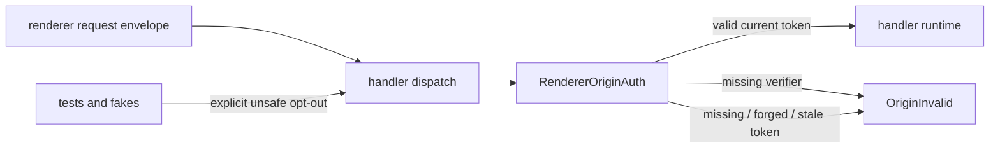

# IPC origin authentication: bridge requests carry windowId+originToken

## What we set out to do

Issue #48 set out to reject spoofed, replayed, or stale renderer bridge envelopes at the runtime boundary. The intended invariant was that a request must carry a `(windowId, originToken)` pair tied to the host's current token for that WebView, and mismatches must return `OriginInvalid` before any handler, decode, permission, or lifecycle work runs.

## What actually ended up working

The implementation added `RendererOriginAuth` as the verifier port on `Handlers.withOptions`, backed by a current-token map and typed `OriginInvalid` failures. The final shape changed after review: origin auth is no longer optional at runtime dispatch. If no verifier is configured, `Handlers(...)` and `Handlers.withOptions(...)` fail closed with `OriginInvalid`; tests and local fakes must opt out explicitly through `RendererOriginAuth.unsafeDisabledForTests`.

## What surfaced in review

One automated review thread was addressed. It found that the first version made origin authentication opt-in by guarding verification on `originAuth !== undefined`, leaving the primary `Handlers(...)` constructor unauthenticated. The fix made the default verifier fail closed and resolved the thread silently after push. No pushbacks or escalations remained.

## First-principles postmortem

The invariant is not "support origin auth"; the invariant is "an unauthenticated renderer envelope never reaches handler-owned work." Optional verification protected only callers that remembered to configure it. A boundary security mechanism must be the default path, while bypasses need visible names and narrow use.

## Game-theory postmortem

The local incentive was test convenience: leaving auth optional kept existing handler tests small. That created the bad equilibrium where production callers could make the same convenient move and silently skip the security boundary. Moving the default to fail closed made the secure move cheaper for production and made the insecure move noisy through `unsafeDisabledForTests`.

## Non-obvious lesson

For boundary security, a verifier seam is not enough unless the default constructor fails closed. Optional security is a documentation promise; fail-closed security is a runtime property. Effect makes the right shape cheap here because the missing-verifier case can return the same typed `OriginInvalid` value as forged and stale tokens.

## Reproducible pattern (if any)

When adding a security boundary:

- Put the check before lifecycle, handler lookup, decode, and permission work.
- Make the default path fail closed with the same typed error family.
- Give tests an explicit unsafe opt-out whose name carries the risk.
- Add one regression test for the default constructor path, not only the configured path.

## AGENTS.md amendment candidate (if any)

For security boundaries, default constructors must fail closed and test bypasses must be explicit and named unsafe. Why: opt-in security creates a production bypass shaped exactly like test convenience.

This is a proposal. Review and edit AGENTS.md yourself if you want to adopt it — `/learn` never auto-edits AGENTS.md.
