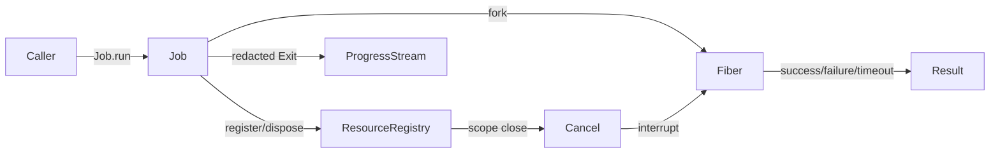

# Job service: enqueue, run, observe long-running unit of work with cancellation

## What we set out to do

Issue #91 asked for the core `Job` primitive from §12.5: a long-running,
cancelable unit of Effect work with typed progress, typed result failure,
timeout support, scope cleanup, redaction, and a running-job list for later
devtools surfaces.

## What actually ended up working

The implementation stayed close to the proposed architecture but made the
registry boundary concrete: `Job.run` starts the work in a managed fiber,
registers a `job` resource with `ResourceRegistry`, exposes a scoped progress
stream, and removes the running snapshot when the job reaches a terminal state.
The durable shape is a single core service rather than a worker pool or a
devtools package feature. Progress is decoded with Effect Schema, redacted
before storage or fanout, and carried through an `Exit`-valued bus so invalid
progress becomes a typed stream failure instead of a logged side channel.

## What surfaced in review

The PR received two Codex review findings, both addressed. The P1 finding was
that cancellation could set the result to `Canceled` and then let the interrupted
fiber overwrite `status` to `failed`; the fix preserves the canceled state and
added a status assertion. The P2 finding was that progress replay used an
unbounded array even though `progressBufferSize` existed; the fix truncates the
replay log to the same configured window and added a bounded replay test.

## First-principles postmortem

The invariant was that terminal job state is one fact, not two independent
facts. `result` and `status` must describe the same terminal transition, or
devtools and UI code will make different claims about the same job. The
assumption that interrupt cause alone was enough to classify termination was
wrong; cancellation is initiated by the handle and must remain the source of
truth after the fiber observes interruption.

## Game-theory postmortem

The local incentive was to make progress replay convenient by retaining every
event and to classify failures by the fiber's final cause. Both choices are
locally simple and globally expensive: high-frequency jobs can grow memory
without bound, and status-driven consumers can misreport user-initiated
cancellation as failure. The mechanism that aligned behavior was treating
`progressBufferSize` as the single budget for both live fanout and replay, and
treating the status ref as the authoritative terminal transition once cancel has
won the race.

## Non-obvious lesson

For cancelable Effect fibers, the interruption cause is not the domain event.
The domain event is the state-machine transition that requested interruption.
Consumers need the transition, not just the fiber's mechanical exit reason.

## Reproducible pattern (if any)

When a runtime primitive has both a status ref and a result channel, derive both
from one terminal transition.
When a stream has a live buffer size, apply the same budget to replay storage.
When a producer can fail validation, publish the failure through the stream
error channel instead of logging it.

## AGENTS.md amendment candidate (if any)

Runtime services with progress streams should apply the same bounded budget to
live fanout and replay storage. Why: a "buffer size" that does not bound replay
creates hidden memory growth.

This is a proposal. Review and edit AGENTS.md yourself if you want to adopt it
-- `/learn` never auto-edits AGENTS.md.
