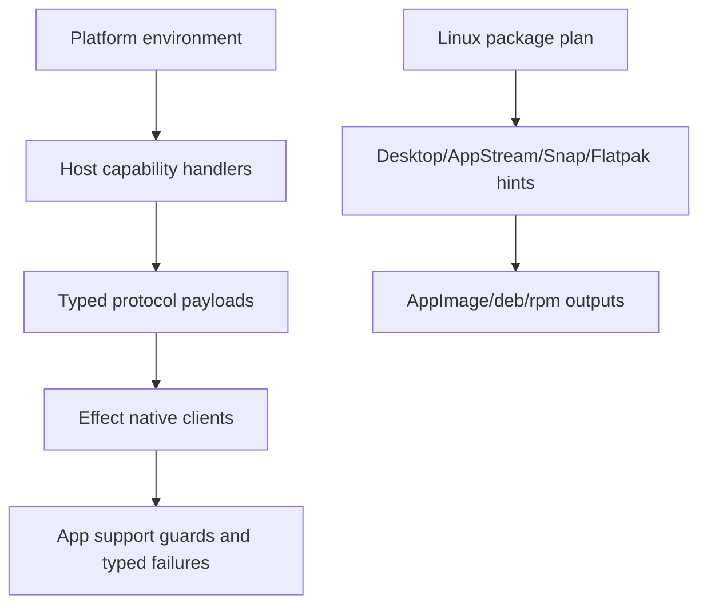

# Linux-specific polish -- Wayland fallback, Snap/Flatpak hints, secret service

## What we set out to do

Linux needed first-party capability answers for compositor, launcher, and secret-service differences. The target was not to pretend every Linux environment supports the same primitives, but to make `GlobalShortcut`, `SafeStorage`, and Dock capability checks return typed values that match Appendix K and to put Snap/Flatpak launcher hints into Linux artifacts.

## What actually ended up working

The shipped shape split the work into two data-returning boundaries. The Rust host now has explicit protocol method constants and capability handlers for `Dock.isSupported`, `GlobalShortcut.isSupported`, `GlobalShortcut.isRegistered`, and `SafeStorage.isAvailable`; those handlers return payloads or `HostProtocolError::Unsupported`, not missing-method failures. The TypeScript native package adds Linux clients that model Wayland global shortcuts, Dock partial support, and SafeStorage availability through Effect values. The package pipeline writes `.desktop`, AppStream, Snap, and Flatpak hint files into AppImage, deb, and rpm staging outputs and records the integration fields in `artifact.json`.

## What surfaced in review

Two review comments were addressed. Both caught the same cross-platform boundary mistake: Linux capability helpers were initially wired directly into shared host routes, so macOS and Windows would have answered support questions using `XDG_SESSION_TYPE` and Secret Service state. The fix made capability answers platform-scoped: Linux probes only run on Linux; other targets return current host-adapter support values without reading Linux environment signals.

## First-principles postmortem

The invariant was that `isSupported` is a guard, not a hint. A bad guard is worse than a missing implementation because it teaches correct callers to take the wrong branch. The initial implementation treated “Linux polish” as a place in the router rather than a platform-specific source of facts. Once that was restated, the correct shape was to keep the protocol method shared but make the capability source target-scoped.

## Game-theory postmortem

The local incentive was to remove `MethodNotFound` quickly by adding one host route, but that made a Linux-specific answer globally visible. Review corrected the incentive by testing the caller’s payoff: apps that obey the guard would lose features on non-Linux systems. The better mechanism is to make capability routes prove their platform scope in tests, so the easiest future change is to add a platform row rather than reuse an unrelated probe.

## Non-obvious lesson

Capability probes are source-of-truth code. They must be scoped to the platform that owns the fact, even when the protocol method is cross-platform. Sharing the route is fine; sharing the probe is a regression unless the probed fact is genuinely platform-neutral.

## Reproducible pattern (if any)

For cross-platform `isSupported` handlers:

1. Keep the protocol method name shared.
2. Put platform facts behind target-scoped helper functions.
3. Assert at least one non-target platform answer when the helper lives in shared host code.
4. Return typed unsupported values from commands; do not let callers infer support from `MethodNotFound`.

## AGENTS.md amendment candidate (if any)

For cross-platform capability methods, require platform-scoped probes plus non-target regression tests. Why: a shared `isSupported` route can silently export one platform's environment facts to every caller.

This is a proposal. Review and edit AGENTS.md yourself if you want to adopt it -- `/learn` never auto-edits AGENTS.md.
