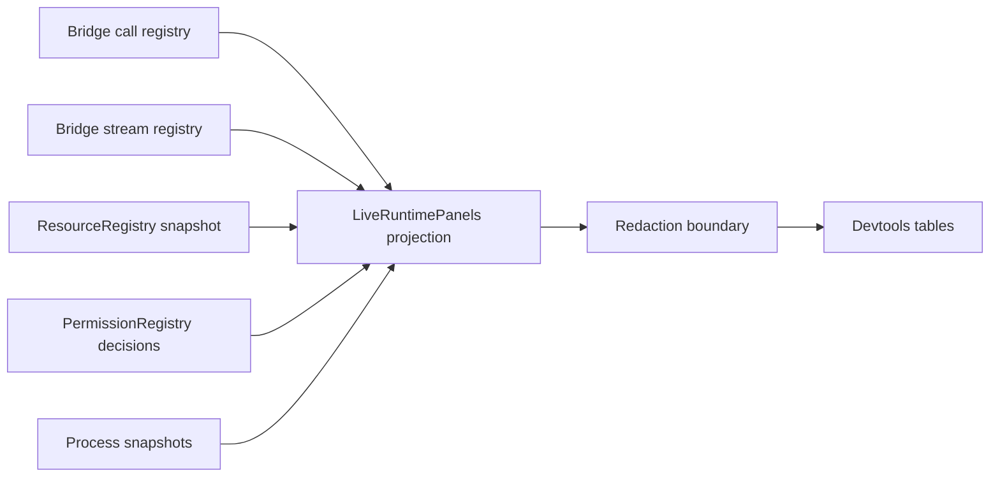

# Live panels for bridge, streams, resources, permissions, processes

## What we set out to do

Issue #20 asked for devtools tables that answer what the runtime is doing now across bridge calls, streams, resources, permissions, and processes. The architectural intent was one runtime-owned truth source, redaction before display, bounded panel rows, bridge latency and errors, permission remediation hints, and process ownership without adding logs, traces, metrics, PTY, worker, or command panels.

## What actually ended up working

The useful shape was not a new devtools event bus. The runtime owners now expose narrow observation APIs: bridge call history, bridge stream snapshots, permission decision history and events, resource snapshots, and process snapshots. `LiveRuntimePanels` stays a projection over those owners, applies redaction at the panel boundary, and derives table rows without owning runtime state. Bridge call rows are reduced from lifecycle states so latency is calculated only when a call has both `Pending.startedAt` and `Completed.completedAt`; failures preserve typed error tags without leaking payloads.

## What surfaced in review

There were no GitHub review threads before the learning pass. The implementation review still changed the final shape in two places: permission decisions are audited before being recorded for devtools, and process snapshots are bounded so a long-lived process service does not accumulate unbounded terminal history.

## First-principles postmortem

The invariant that mattered most was source ownership. A devtools panel may reduce, redact, and display runtime facts, but it must not become the place where those facts are created. That pushed observation methods into the modules that already own each lifecycle. The assumption that changed was that every source needed a fresh event stream; for current-state panels, `SubscriptionRef` snapshots are a better primitive because they encode both current value and updates.

## Game-theory postmortem

The local incentive is to make the panel look complete by inventing a parallel cache in devtools. That creates a bad equilibrium where the debugging surface can drift from the runtime and engineers regain the old habit of trusting ad hoc logs. The alignment mechanism is owner-owned observation plus a redaction boundary: each runtime module has one reason to tell the truth about its state, and devtools has one reason to transform that truth for display. Future review should check that any new panel row is derived from the module that owns the lifecycle, not from a display-side cache.

## Non-obvious lesson

Live devtools panels need current-state primitives more than event-stream purity. `SubscriptionRef` is the right Effect primitive when consumers need an immediate snapshot and subsequent changes, while `PubSub` fits append-only decision events. Using the wrong primitive would either lose the first frame or force devtools to own reconstruction state that belongs in runtime modules.

## Reproducible pattern (if any)

Expose `list` plus `observe` from the module that owns the lifecycle.
Use `SubscriptionRef` for current snapshot plus updates.
Use `PubSub` for append-only events.
Apply redaction at the boundary that converts runtime facts into display rows.
Keep display reducers bounded and pure.

## AGENTS.md amendment candidate (if any)

For devtools panels, prefer owner-owned `list`/`observe` APIs backed by Effect primitives over display-side caches; Why: debugging surfaces must not become a second source of runtime truth.

This is a proposal. Review and edit AGENTS.md yourself if you want to adopt it — `/learn` never auto-edits AGENTS.md.
