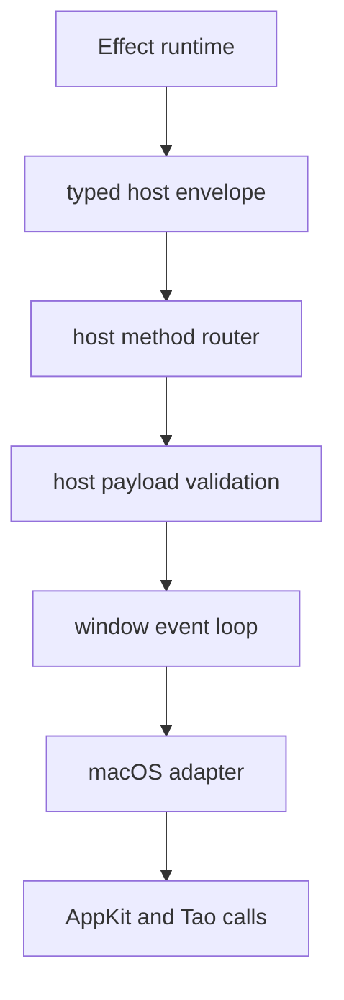

# macOS-specific polish host boundaries

## What we set out to do

Issue #103 asked the framework to make macOS polish first-party: configured vibrancy should attach native visual effect views, traffic-light offsets should reach the Tao window builder, Dock badge count/text and attention should route through the host, and application/window menus should use the macOS menu bar path. The constraint was that app code and Effect services keep typed failures as values while the Rust host owns the AppKit/Tao details.

## What actually ended up working

The final shape kept the intended boundary: TypeScript clients only encode typed host envelopes, `host-protocol` owns the canonical wire names and window polish payload, and `crates/host/src/macos.rs` hides the AppKit/Tao details. The architecture changed by making menu root validation part of the host method boundary, not only the native builder, because macOS application menus require submenu roots even though the generic `MenuTemplate` grammar allows item roots for other menu surfaces. `window-vibrancy` became the small target-scoped dependency that attaches `NSVisualEffectView`, while `muda` handles the application menu install path.

## What surfaced in review

Two review comments were addressed and resolved. The first found that root menu entries could pass the generic TypeScript schema and then fail later inside the macOS menu builder; the fix added explicit host-side validation that application menu roots are submenus. The second found that `Dock.setBadgeCount` and `Dock.setBadgeText` shared a host helper that always reported `Dock.setBadgeText` on missing-window failures; the fix carried the caller operation through the window command path so typed errors preserve telemetry and recovery identity. There were no pushbacks and no escalations.

## First-principles postmortem

The invariant that mattered most was boundary honesty: a method that accepts a value must either install that value correctly or reject it with the correct typed operation before any platform side effect. The early assumption was that the generic menu tree could be passed straight into the macOS adapter and let the builder fail. That was wrong because a late failure hides the real contract at the wrong layer. The source of truth became the platform-owned host boundary: it can keep the cross-platform schema broad while narrowing the accepted shape for the specific native operation.

## Game-theory postmortem

The local incentive was to make the existing `MenuTemplate` shape green quickly and let the platform adapter discover unsupported structures. That creates a bad equilibrium where app authors learn about platform constraints only after transport and event-loop hops, and telemetry mislabels failures when multiple methods share a helper. The better mechanism is to pass the operation name and platform-specific acceptance rule through the narrow host method interface. This makes the honest move cheaper for future contributors: validation happens near the method name, and the native adapter receives only values it can try to install.

## Non-obvious lesson

Generic schemas are not enough for platform-owned native APIs. They describe portable data, but each host method still needs to state the subset it can honestly execute on the current platform and return failures with the exact originating operation.

## Reproducible pattern (if any)

When a portable service method reaches a platform adapter:

1. Decode the generic shape at the TypeScript boundary.
2. Validate the platform-specific subset at the host method boundary.
3. Carry the originating method name into shared helpers.
4. Return `Unsupported` or `InvalidArgument` before native side effects when the platform cannot honor the value.

## AGENTS.md amendment candidate (if any)

For platform-specific host methods, validate the platform-executable subset at the host method boundary and preserve the originating operation in shared helper errors; Why: generic schemas can otherwise promise values the native adapter cannot honestly execute.

This is a proposal. Review and edit AGENTS.md yourself if you want to adopt it — `/learn` never auto-edits AGENTS.md.
