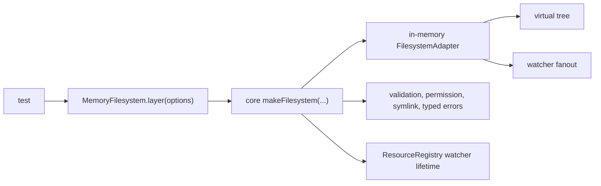

# Memory filesystem: in-memory Filesystem substitute

## What we set out to do

Issue #37 asked for a deterministic in-memory `Filesystem` substitute that could replace real temp directories in tests while preserving the same contract: typed failures, permission and symlink policy, atomic writes, watcher subresources, and resource-registry cleanup.

## What actually ended up working

The winning shape was to put only the storage tree and watcher fanout in `@effect-desktop/test`, then run that adapter through the production `makeFilesystem(...)` service. That kept validation, permissions, symlink escape checks, watcher resource registration, and typed error mapping in one production-owned path. The final API exposes `makeMemoryFilesystem(registry, options)` and `MemoryFilesystem.layer(options)` with seedable directories, files, symlinks, permissions, and deterministic time.

## What surfaced in review

Seven review findings were addressed. The first set found that the fake allowed impossible disk states: writing over directories, atomic rename over directories, recursive mkdir through files, and non-recursive mkdir over existing entries. The second set found deeper path fidelity gaps: directory rename did not move descendants, intermediate symlinks were not resolved, and relative symlink fixtures were treated as root-relative paths. No comments were pushed back or escalated; each finding tightened the adapter until the fake matched the production filesystem contract more closely.

## First-principles postmortem

The invariant was not "tests avoid disk"; it was "tests observe the same filesystem contract without disk." Avoiding disk is only useful if the fake cannot create states that a real filesystem rejects. The assumption that reusing the production service was sufficient was only half true: it preserved policy and typed errors above the adapter, but the adapter still had to model host `fs` failure semantics for mutations and path resolution.

## Game-theory postmortem

The local incentive for a fake is speed: implement the smallest tree map that satisfies the happy-path tests. That creates an information asymmetry where tests look deterministic but stop predicting production behavior. Review corrected the incentive by comparing negative semantics against real `fs`, making fidelity the acceptance condition instead of convenience. The bad equilibrium avoided was a fast fake that silently trained app tests to depend on impossible filesystem states.

## Non-obvious lesson

Putting a fake under the production Effect service is necessary but not sufficient. It preserves service-owned policy, resource lifetime, and typed error mapping, but every adapter primitive is still a contract boundary. For filesystem substitutes, negative behavior matters as much as positive behavior: `EISDIR`, `EEXIST`, `ENOTDIR`, symlink base semantics, and directory subtree movement are part of the API surface that tests will learn from.

## Reproducible pattern (if any)

Build substitutes below the production service when the service owns policy.
Then test the substitute against production-negative cases, not only happy paths.
Every mutable fake should reject impossible real-world states before test authors can depend on them.
For path-like adapters, cover platform separators, intermediate symlinks, relative symlinks, and rename subtree behavior.

## AGENTS.md amendment candidate (if any)

When adding an in-memory substitute for a production adapter, include tests for the production adapter's negative semantics and path/resource edge cases. Why: a fast fake that accepts impossible states makes downstream tests less predictive.

This is a proposal. Review and edit AGENTS.md yourself if you want to adopt it -- `/learn` never auto-edits AGENTS.md.
