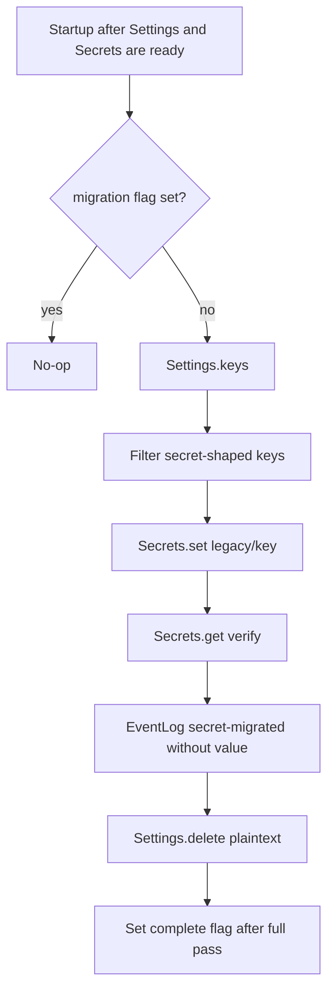

# Migrate legacy plaintext settings into Secrets on first launch

## What we set out to do

Move pre-Secrets plaintext credentials out of Settings on first launch, put them into the `legacy` Secrets namespace, verify the write, remove the plaintext row, audit without values, and write `migration.secrets.v1.complete` only after the full pass succeeds.

## What actually ended up working

The implementation kept the issue architecture but made the Settings boundary explicit instead of reaching into SQLite. `SettingsStore` now exposes narrow `keys()` and `delete()` Effects, and `runSecretsMigration` composes Settings, Secrets, and optional EventLog ports. The migration lists keys, filters with the §14.10 redaction pattern, reads each legacy string, writes `SecretValue` to Secrets, verifies read-back, audits `secret-migrated`, deletes the plaintext row, and sets the flag after the full pass.

## What surfaced in review

There were no PR review comments or issue comments before learning. Local validation and Blacksmith CI were the review pressure for this pass.

## First-principles postmortem

The invariant was that a migration may be retried after partial failure without either losing the secret or falsely claiming completion. That means the complete flag is not a per-key checkpoint; it is a full-pass proof. Each key must move through write, verify, audit, and delete as Effect values with typed failure phases so startup can retry instead of throwing.

## Game-theory postmortem

The dangerous local incentive is to delete first after verification, then audit as a side effect. That makes the happy path clean but creates a bad retry equilibrium: if audit fails after deletion, the legacy key is gone, the flag is unset, and the next launch cannot produce the missing audit event. Auditing before destructive deletion better aligns the mechanism with the operator's need for evidence. A delete failure can retry and may duplicate an audit event, but it does not silently erase the only plaintext source before evidence exists.

## Non-obvious lesson

For migrations that destroy legacy state, audit ordering is part of the data-safety contract. "Write, verify, delete, audit" looks natural because the audit describes the finished operation, but it can lose the source and the evidence in different stores. "Write, verify, audit, delete" preserves retryability and observability under partial failure.

## Reproducible pattern (if any)

Model migrations as a small Effect program with explicit phases.
Expose narrow source-store capabilities instead of importing storage internals.
Write the completion flag only after the full pass succeeds.
Place audit before destructive cleanup when retrying can otherwise erase evidence.

## AGENTS.md amendment candidate (if any)

For migrations that delete legacy user data, audit or checkpoint before destructive deletion. Why: a post-delete audit failure can leave the source gone, completion unset, and no retry path for the missing evidence.

This is a proposal. Review and edit AGENTS.md yourself if you want to adopt it -- `/learn` never auto-edits AGENTS.md.
