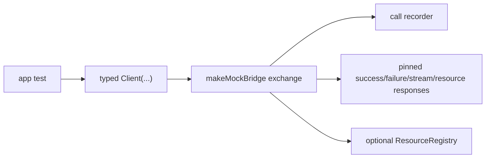

# Mock bridge: contract-aware fake that records calls

## What we set out to do

Tests needed a bridge fake that lets application code call typed contracts and assert what was called, in order, without hand-writing wire envelopes. The mock also needed pinned success, failure, stream, and resource responses while keeping resource handles tied to the real `ResourceRegistry`.

## What actually ended up working

The stable seam was not a second bridge runtime. The existing typed `Client(...)` already owns contract encoding, decoding, stream frame decoding, resource proxy creation, and typed error channels. `MockBridge` therefore implements `ApiClientExchange`, records request envelopes at that seam, and exposes `client(contracts, options)` so tests still exercise the same typed client path as production.

## What surfaced in review

No PR review comments changed the design. CI surfaced the useful review finding: tests that call `Api.Tag(...)` are order-dependent because other suites can freeze the global contract registry first. The fix was to use local contract classes in the mock bridge tests so the fake tests verify the client seam without mutating global registry state.

## First-principles postmortem

The invariant was substitutability: a test using the mock must exercise the same typed bridge vocabulary as the real renderer client. The assumption that changed was where "contract-aware" should live. It did not require a new registry-backed mock runtime; it required keeping the real client as the contract-aware module and faking only the exchange underneath it.

## Game-theory postmortem

If the mock exposed a broad fake bridge runtime, future tests would be rewarded for bypassing the real client path and pinning behavior behind another abstraction. Keeping the mock at `ApiClientExchange` aligns the local incentive with system correctness: the easiest test path is the real typed client path. The Windows CI failure also exposed a bad equilibrium in tests that mutate global registries; local contract fixtures remove order as hidden shared state.

## Non-obvious lesson

Contract-aware tests should prefer local contract classes over global `Api.Tag(...)` registration once the registry can be frozen by production-safety tests. The global registry is the runtime discovery mechanism, not the safest unit-test fixture primitive.

## Reproducible pattern (if any)

Find the narrow seam already consumed by production code.
Put the fake below that seam, not beside the production abstraction.
Use local immutable fixtures for tests when the production registry has lifecycle state.
Keep failures in `Effect` and stream error channels.

## AGENTS.md amendment candidate (if any)

When testing typed API contracts, avoid mutating the global contract registry unless registry behavior is the subject of the test; Why: registry freeze/order state makes otherwise local tests platform-order dependent.

This is a proposal. Review and edit AGENTS.md yourself if you want to adopt it - `/learn` never auto-edits AGENTS.md.
