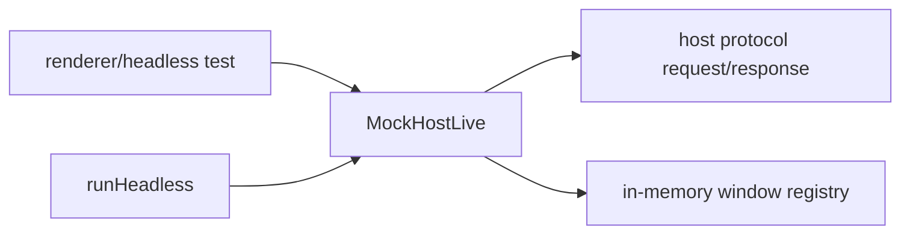

# Mock host: in-process host protocol implementation for renderer tests

## What we set out to do

Renderer tests needed a host-protocol peer that runs in-process, speaks real request/response envelopes, preserves trace IDs, and exercises required host methods without launching native windows, WebViews, or a child runtime. The mock also needed to fit the existing headless resource lifecycle so leak detection remains meaningful.

## What actually ended up working

The repo already had the right behavior hidden inside `runHeadless`. The durable fix was to promote that internal host into `MockHost`, an exported Effect service with `MockHostLive`, and make `runHeadless` consume the same implementation. `MockHost` records real host-protocol requests, preserves `traceId` on responses, exposes a read-only window snapshot, supports fixtures, and models unknown `Window.destroy` as a typed `NotFound` value.

## What surfaced in review

No blocking review findings surfaced. The review pressure was to avoid a second fake host and to avoid exposing mutable internals. The final API returns copied call/window snapshots and keeps the request path in the `Effect` error channel.

## First-principles postmortem

The invariant was contract substitutability: tests should use the same host-protocol clients they use against a real host. The source of truth is the host-protocol envelope and bridge client contracts, not a bespoke renderer-test helper.

## Game-theory postmortem

If the mock host stays hidden inside `runHeadless`, future tests are tempted to create one-off fakes for each scenario. Exporting the existing mock as a narrow service changes the payoff: the easiest test path is also the contract-correct path. Returning snapshots rather than live maps prevents tests from mutating host state behind the mock's lifecycle rules.

## Non-obvious lesson

The useful abstraction was already present but too private. Deepening it meant exposing the narrow protocol-facing surface while keeping fixture resolution and mutable state inside the module.

## Reproducible pattern (if any)

When a test harness already owns a realistic fake, promote that fake before writing another one.
Expose snapshots, not mutable state.
Route higher-level helpers through the same fake so behavior cannot drift.

## AGENTS.md amendment candidate (if any)

Before adding a new test substitute, search existing harness helpers for hidden fakes to promote; Why: parallel fakes make tests locally easy but globally inconsistent.

This is a proposal. Review and edit AGENTS.md yourself if you want to adopt it - `/learn` never auto-edits AGENTS.md.
