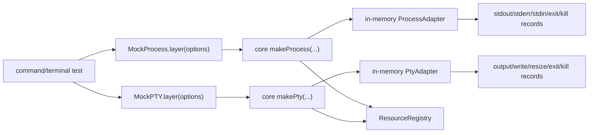

# Mock Process and Mock PTY for command-running tests

## What we set out to do

Issue #38 asked for deterministic `Process` and `PTY` substitutes so command and terminal tests can run without real subprocesses while preserving lifecycle, output, stdin/write, resize, kill, and scope-cleanup behavior.

## What actually ended up working

The stable shape was the same mechanism used for the memory filesystem: keep the fake below the production service. `MockProcess.layer(options)` and `MockPTY.layer(options)` provide core `Process` and `PTY` services through in-memory adapters passed to `makeProcess(...)` and `makePty(...)`. The adapters own deterministic child streams and call records; the production services still own validation, permissions, budgets, typed error mapping, output buffering, resource registration, and cleanup.

## What surfaced in review

One review finding was addressed. `MockPtyFixture.pid` was optional, but the first implementation always generated a PID, making the `Option.none` branch impossible to test. The fix made no-PID fixtures explicit with `pid: null` and added coverage that the handle exposes `Option.none` and the call record keeps `pid` absent. No comments were pushed back or escalated.

## First-principles postmortem

The invariant was not "do not spawn real processes"; it was "tests observe the same service contract without spawning real processes." A fake child can be plain TypeScript because it is the adapter boundary, but the service path above it must remain Effect-owned. The missing-PID review showed that optional states in production handles are contract states, not type noise; a mock that cannot produce them prevents consumers from testing their own exhaustive handling.

## Game-theory postmortem

The local shortcut is to make every fake command succeed with a PID and no output. That is fast, but it rewards tests that forgot to seed behavior and hides missing branches. The final mock makes missing fixtures fail as typed `InvalidArgument` values through the production mapper, and it requires an explicit `pid: null` to model unavailable PTY PIDs. The mechanism changes the payoff: precise fixtures are cheap, silent accidental success is unavailable.

## Non-obvious lesson

For in-memory runtime substitutes, optional production handle fields must be fixture-addressable. If a field is `Option` in the real service, the mock has to let tests create both `Some` and `None`; otherwise the substitute is contract-shaped but not contract-complete.

## Reproducible pattern (if any)

Put deterministic child adapters under the production service.
Make missing fixtures fail loudly through the typed error channel.
Expose call records for observability, but do not move policy into the fake.
For `Option` fields, use explicit fixture values for both present and absent states.

## AGENTS.md amendment candidate (if any)

When adding a mock for a production service, every public optional or union state in the production handle must be constructible by fixtures. Why: otherwise the mock prevents consumers from testing exhaustive handling of the real contract.

This is a proposal. Review and edit AGENTS.md yourself if you want to adopt it -- `/learn` never auto-edits AGENTS.md.
