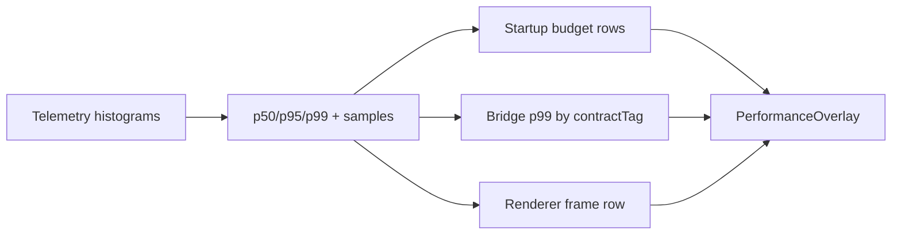

# Performance overlay for startup, bridge p99, render frame

## What we set out to do

Issue #24 asked for a live performance overlay that makes startup phase timings, bridge call p99, and renderer frame time visible against the §21 budgets during development. The overlay must read canonical performance metrics, keep budget thresholds inline, preserve redaction, and avoid perturbing the measurements it displays.

## What actually ended up working

The overlay stayed as a devtools projection over `Telemetry` histograms. `TelemetryHistogramSnapshot` now retains bounded samples and publishes p50, p95, and p99, which lets the overlay compare real p99 values to spec budgets without owning a measurement store. `PerformanceOverlay` maps startup metric names to §21.2 development and production budgets, groups bridge latency samples by `contractTag`, and exposes renderer frame timing against a fixed frame budget. Rows carry current value, budget, ratio, status, and samples for sparkline rendering.

## What surfaced in review

One automated Codex review comment found that bridge p99 rows were initially one row per full telemetry tag set. Because telemetry metrics are keyed by every tag, two bridge latency histograms with the same `contractTag` but different `windowId` would split the p99 and duplicate the row id. The fix aggregates all bridge samples by `contractTag` before computing p99 and adds regression coverage for duplicate contract tags.

## First-principles postmortem

The invariant was "p99 by contract tag," not "show every bridge latency histogram." The metric aggregator can preserve high-cardinality dimensions for other views, but the overlay has a different question: is this contract tag over budget? That means the overlay reducer owns the grouping policy while telemetry owns raw metric aggregation and bounded samples.

## Game-theory postmortem

The local incentive is to render whatever metric rows already exist because it is mechanically simple. That creates a misleading overlay: the more dimensions engineers add for debugging, the less accurate the p99-by-contract view becomes. The alignment mechanism is a named reducer that collapses only the dimensions the overlay promises to compare. Future review should check whether each overlay row answers its documented budget question rather than mirroring lower-level metric keys.

## Non-obvious lesson

Metric identity and display identity are different concepts. Telemetry should key metrics by the full tag set so producers do not lose information, but a budget overlay must regroup those samples by the budget's dimension before computing status. If the view's grouping dimension is not explicit, richer telemetry can make the display less true.

## Reproducible pattern (if any)

Keep full-cardinality metric snapshots in `Telemetry`.
Define overlay-specific grouping reducers beside the overlay.
Compute budget status after grouping, not before.
Test duplicate lower-level tags that should collapse into one budget row.

## AGENTS.md amendment candidate (if any)

When projecting telemetry into a budget view, compute status after regrouping by the budget dimension; Why: full-cardinality metric keys can otherwise split p99 and hide regressions.

This is a proposal. Review and edit AGENTS.md yourself if you want to adopt it — `/learn` never auto-edits AGENTS.md.
