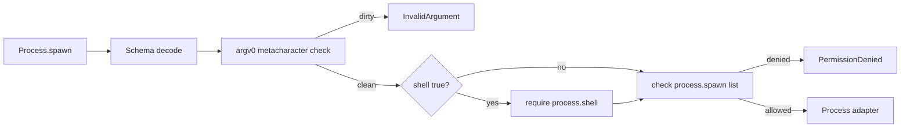

# Permission-gated argv allow-list per §14

## What we set out to do

Issue #111 required `Process.spawn` to fail closed unless the caller has explicit authority to spawn the requested binary. The gate also needed to preserve §11.10 argv discipline by rejecting shell metacharacters in `argv[0]` and requiring a separate `process.shell` capability when shell mode is requested.

## What actually ended up working

The implementation followed the same static-policy shape used by the filesystem permission work instead of inventing the Phase 16 dynamic registry early. `ProcessPermissionPolicy` is injected into `makeProcess`, defaults to an empty policy, and is checked inside `Process.spawn` before the adapter sees the request. Denied binaries return `PermissionDenied` with `process.spawn`; shell-mode requests without shell authority return `PermissionDenied` with `process.shell`; metacharacter-shaped commands return `InvalidArgument`.

## What surfaced in review

Internal code review found no actionable issues. The important pressure point was scope: the issue sketch named a stubbed `PermissionRegistry`, but the repo did not yet have a generic registry. Reusing an injected static policy kept the permission decision local, typed, and testable while leaving the dynamic prompt and grant flow to Phase 16.

## First-principles postmortem

The invariant is that process spawning is authority-bearing work, not a neutral runtime helper. If `Process.spawn` has ambient authority, every caller that can reach it can choose the host binary. The smallest correct boundary is therefore the service method itself: decode the request, reject command-shaped injection, check capability data, and only then cross into the adapter.

## Game-theory postmortem

The tempting local move is to keep tests and development convenient by allowing all commands until the permission system exists. That creates the bad equilibrium where production hardening depends on a future cleanup pass. Default-empty permissions reverse the payoff: tests must name their intended binaries, production code cannot accidentally inherit broad authority, and future PermissionRegistry wiring has one existing policy seam to replace.

## Non-obvious lesson

A placeholder permission system should still fail closed. The useful stub is not a permissive fake registry; it is a narrow injected policy that forces callers and tests to declare authority now, while hiding how Phase 16 will source that authority later.

## Reproducible pattern (if any)

Add static policy at the service boundary.
Default to no authority.
Validate injection-shaped inputs before capability lookup.
Return closed HostProtocol errors as Effect failures.
Leave dynamic grant acquisition to the phase that owns it.

## AGENTS.md amendment candidate (if any)

When a future phase will provide dynamic permissions, use an injected static policy that fails closed in the current phase instead of a permissive placeholder. Why: tests and callers must encode the intended authority before production wiring exists.

This is a proposal. Review and edit AGENTS.md yourself if you want to adopt it — `/learn` never auto-edits AGENTS.md.
