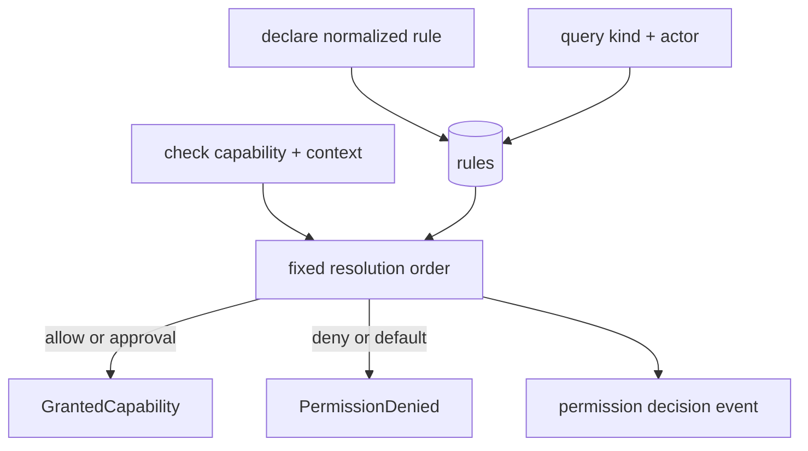

# PermissionRegistry Effect service

## What we set out to do

Issue #41 asked for the Phase 16 capability chokepoint: a central Effect service
that records normalized capability declarations, answers actor-scoped queries,
and denies privileged checks by default. The important invariant was that callers
receive either a `GrantedCapability` token or a typed denial value, with every
decision audited against the normalized capability rather than a renderer method
name.

## What actually ended up working

The shipped implementation keeps the first version intentionally narrow:
`makePermissionRegistry` owns an in-memory rule list, exposes
`declare/query/check`, and returns typed Effect failures for invalid inputs,
denials, and audit write failures. It preserves the issue's resolution order:
explicit deny, revoked/expired/consumed, approval-denied, approval, allow, then
default deny. Filesystem roots are not exact-string grants; a declared root
authorizes descendant paths while declared deny roots block descendants.

## What surfaced in review

There were no PR review threads or comments. Local verification caught the
meaningful API mismatch before review: Effect v4 `Schema.Literals` and
`Schema.Union` take arrays in this repo, and the schema-derived union types only
narrowed correctly after matching that shape.

## First-principles postmortem

The core object is not a permission flag; it is authority. That made
`GrantedCapability` the useful return value and `PermissionDenied` the useful
failure value. The implementation stayed smaller when it treated approval UI,
token expiry propagation, and production checking as later mechanisms rather
than folding lifecycle into the first registry primitive.

## Game-theory postmortem

The bad equilibrium is each privileged service inventing its own policy check
and one caller eventually skipping it. A central registry changes the local
incentive: service authors can depend on one typed check result instead of
re-implementing ordering, audit shape, and default-deny behavior. The next
alignment mechanism is integration pressure: privileged services should require
the granted token at the effect boundary, so bypasses become type-visible.

## Non-obvious lesson

Capability matching needs resource semantics, not only union tags. The first
version that matched filesystem roots by exact string passed the shape of the
API but failed the authority model: `filesystem.write` for `/tmp/app` must cover
`/tmp/app/config.json`, while a deny for `/tmp/app/blocked` must also cover
descendants.

## Reproducible pattern (if any)

Model the authority as a normalized data union. Decode before side effects.
Resolve with an explicit ordered function. Audit the resolved normalized value.
Return tokens and typed denials as values.

## AGENTS.md amendment candidate (if any)

For permission work, require tests for descendant resource matching, not only
exact capability keys. Why: exact-string checks can pass the API contract while
silently under-modeling authority.

This is a proposal. Review and edit AGENTS.md yourself if you want to adopt it —
`/learn` never auto-edits AGENTS.md.
