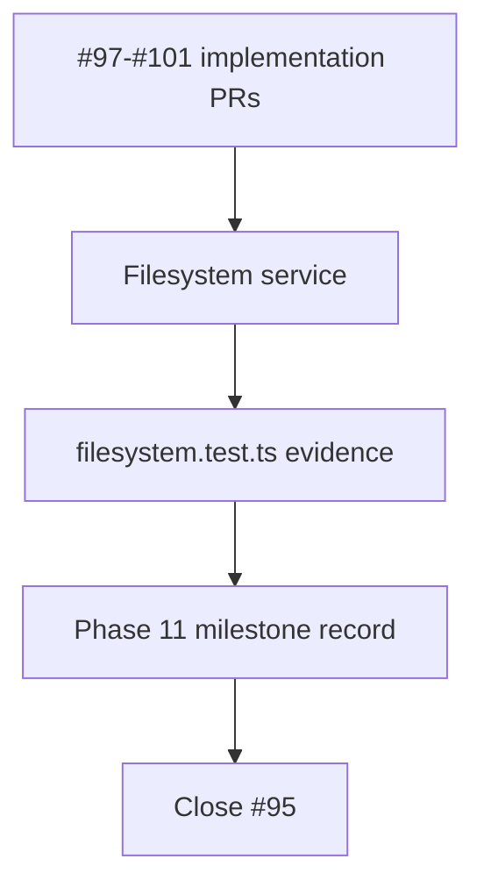

# Phase 11 filesystem

## What we set out to do

Issue #95 was the Phase 11 epic closeout for the core `Filesystem` runtime
service. The implementation slices had already shipped; the remaining work was
to create the durable milestone record that maps §24.11 acceptance criteria,
sub-issue learning, validation commands, and known limitations to evidence.

## What actually ended up working

The closeout stayed documentation-only. `docs/milestones/phase-11-filesystem.md`
now records the service surface, the five implementation PRs, the acceptance
criteria, the Appendix C security evidence, the full validation gate, and the
follow-up phases that own dynamic permissions, mocks, release docs, and API
snapshot work. No runtime code changed because the filesystem behavior already
lived in `packages/core/src/runtime/filesystem.ts` and its tests.

## What surfaced in review

There were no review threads or comments. The local review pass checked the
epic verification text against the milestone document and confirmed that each
verification item maps to either an existing filesystem test, a prior
implementation PR, or a deferred phase called out as a limitation.

## First-principles postmortem

An epic closeout is not an implementation surface; it is an evidence surface.
The invariant is that a future maintainer can inspect one file and understand
what shipped, what was verified, and what was intentionally left to later
phases. Adding code during closeout would have weakened that boundary.

## Game-theory postmortem

The local shortcut is to close the epic because the checkboxes are complete,
leaving future contributors to reconstruct the phase from PR history. The
milestone record changes that payoff: closing the epic now requires a durable
artifact that names the evidence and limitations. That makes the cheap future
move reading one document instead of archaeology across five PRs.

## Non-obvious lesson

Phase epics need a different definition of done than implementation issues.
For a slice, the proof is behavior. For an epic, the proof is traceability:
requirements, files, tests, validation, learnings, and known deferrals must be
connected in one durable record.

## Reproducible pattern (if any)

Before closing an epic, verify every sub-issue is closed. Create the milestone
document from spec acceptance criteria, issue verification text, test names,
learning records, and prior PRs. Run the full gate even when the closeout is
documentation-only. Merge only after the learning file lands.

## AGENTS.md amendment candidate (if any)

None.

This is a proposal. Review and edit AGENTS.md yourself if you want to adopt it —
`/learn` never auto-edits AGENTS.md.
