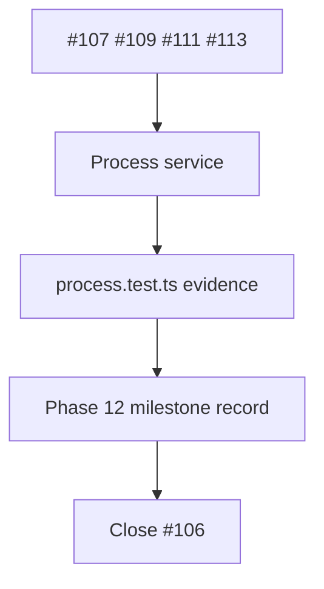

# Phase 12 process

## What we set out to do

Issue #106 was the Phase 12 epic closeout for the core `Process` runtime
service. The process implementation slices had already shipped; the remaining
work was to capture the milestone evidence that ties §24.12 acceptance criteria,
the process epic verification text, tests, validation commands, prior PRs, and
known limitations together.

## What actually ended up working

The closeout stayed documentation-only. `docs/milestones/phase-12-process.md`
now records the public process surface, implementation PRs #206 through #209,
acceptance criteria, the absence of a direct Appendix C row, the full validation
gate, and the later phases that own PTY, dynamic permissions, devtools, workers,
and release API snapshots.

## What surfaced in review

There were no review threads or comments. The local review pass found one
terminology mismatch in the issue body: it described budget failure as
`BudgetExceeded`, while the current closed `HostProtocolError` registry models
that condition as `ResourceBusy`. The milestone records the actual shipped error
shape instead of preserving stale issue wording.

## First-principles postmortem

The primitive concept is controlled execution. That means the closeout evidence
has to cover authority, lifecycle, and bounded output, not only a successful
spawn call. The milestone is useful because it ties those concerns to concrete
tests instead of implying that `Process.spawn` alone proves the phase.

## Game-theory postmortem

The tempting local move is to treat a process service as a thin wrapper over
`Bun.spawn` and leave cleanup, argv discipline, and budgets to caller judgment.
The shipped service and milestone shift the incentive: future work inherits one
ordered Effect program and one evidence file that make bypassing cleanup,
permission checks, or resource limits visible in review.

## Non-obvious lesson

Epic wording can drift from the implementation's closed error vocabulary. The
right source of truth for closeout documentation is the shipped typed error
registry plus tests, not stale prose from the original issue.

## Reproducible pattern (if any)

When closing an epic, compare issue verification language against the actual
typed error names and test assertions. Preserve the shipped contract in the
milestone. Call out mismatches as evidence decisions rather than silently copying
old wording.

## AGENTS.md amendment candidate (if any)

None.

This is a proposal. Review and edit AGENTS.md yourself if you want to adopt it —
`/learn` never auto-edits AGENTS.md.
