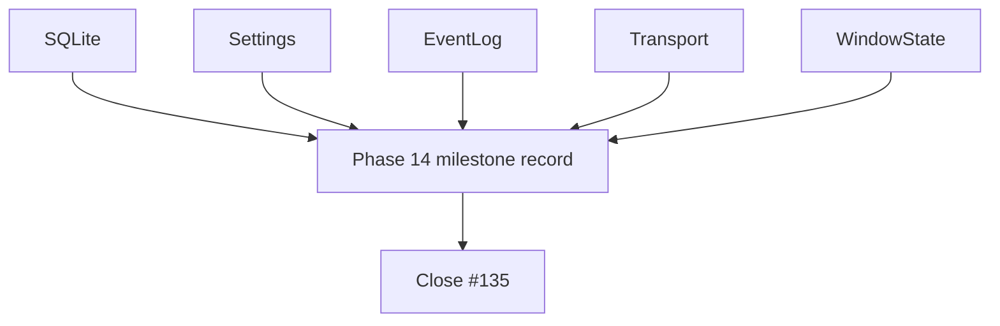

# Phase 14 storage

## What we set out to do

Issue #135 was the Phase 14 epic closeout for the core storage primitives:
`SQLite`, `Settings`, `EventLog`, `Transport`, and `WindowState`. The
implementation slices had already shipped; the remaining work was to capture the
milestone evidence that ties §24.14 acceptance criteria, service-specific tests,
prior PRs, validation commands, and known limitations together.

## What actually ended up working

The closeout stayed documentation-only. `docs/milestones/phase-14-storage.md`
records each storage primitive as a separate public API and maps each one to its
own test file. That shape matters because the phase is broad: transaction scope,
schema migrations, append ordering, frame boundaries, and window-restore sanity
are different invariants and should not be collapsed into one generic storage
claim.

## What surfaced in review

There were no review threads or comments. The local review pass checked the
issue's stronger durability language against the shipped test evidence. The
milestone records current SQLite-backed persistence, reopen/replay, and
retention behavior without claiming an unimplemented forced power-loss simulator.

## First-principles postmortem

Storage is not a single concept. The primitive varies by invariant: SQL
transaction, typed key/value migration, append-only replay, byte framing, and
window rectangle recovery. A useful milestone preserves those boundaries so
future work can strengthen one primitive without muddying the guarantees of the
others.

## Game-theory postmortem

The tempting local move is to write one broad "storage works" closeout because
all five services live in `@effect-desktop/core`. That creates a future review
problem: a contributor cannot tell which invariant was proven by which test. The
milestone changes the incentive by grouping evidence by service, making missing
coverage visible at the same granularity as the shipped APIs.

## Non-obvious lesson

Epic verification prose can name aspirational tests more strongly than the final
slice implemented. Closeout should preserve the shipped contract and known
limitations, not upgrade test evidence by repeating the original aspiration.

## Reproducible pattern (if any)

For broad phase epics, split the milestone by primitive and invariant. Map each
primitive to its test file, prior PR, and limitation. Do not rely on one full
gate as evidence for every service-specific guarantee.

## AGENTS.md amendment candidate (if any)

None.

This is a proposal. Review and edit AGENTS.md yourself if you want to adopt it —
`/learn` never auto-edits AGENTS.md.
