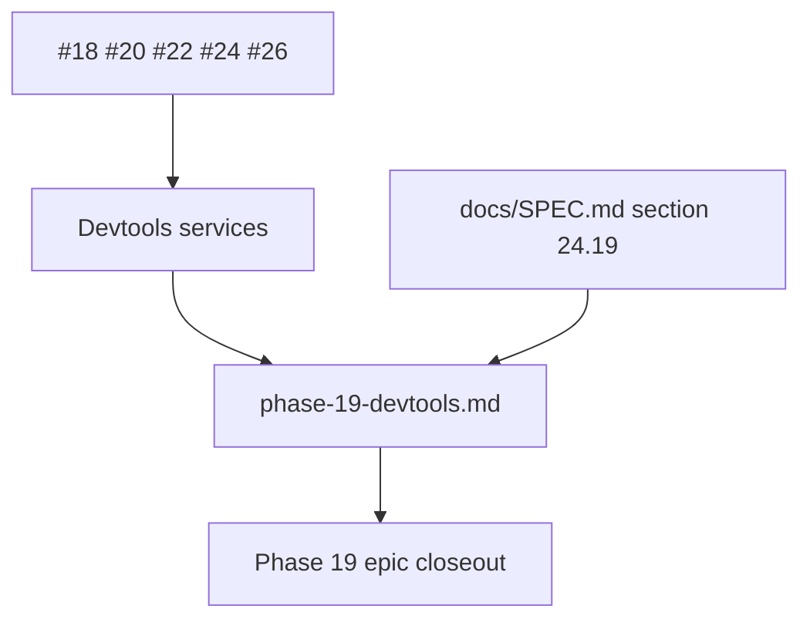

# Phase 19 Devtools closeout

## What we set out to do

Phase 19 set out to make devtools a privileged runtime inspector for framework
state: live panels, diagnostics, performance, redaction, production gating, and
trace correlation across runtime and host boundaries.

## What actually ended up working

The closeout did not add a new devtools subsystem. The five sub-issues had
already shipped the shell, live panels, diagnostics panels, performance overlay,
and trace propagation. The useful work was the durable milestone record:
`docs/milestones/phase-19-devtools.md` now maps those shipped PRs back to
`docs/SPEC.md` §24.19, names the exact files and tests, records the full
validation gate, and states the remaining limitations without pretending the
service projections are a polished native UI.

## What surfaced in review

`/code-review` found no blocking defects. The review pressure was mostly about
truthfulness: the milestone can close the epic only if it preserves the
difference between the shipped Effect service projections and future polished
devtools UX.

## First-principles postmortem

The invariant is that a milestone record is evidence, not marketing. It should
say what exists, where it exists, how it is verified, and what remains deferred.
For devtools, that meant anchoring the closeout to owner-owned runtime state and
read-only projections rather than the original ideal of a full separate
inspector window with every Appendix C panel fully polished.

## Game-theory postmortem

The local incentive in phase closeout is to close the epic by describing the
desired end state instead of the shipped state. That creates a bad equilibrium:
future phases inherit vague confidence and discover missing UX or transport work
late. The mechanism that keeps incentives aligned is a milestone document with
file-level evidence, test-level evidence, known limitations, and follow-up phase
ownership.

## Non-obvious lesson

Phase closeout should be skeptical of the epic architecture. The closeout
artifact must reconcile the original design with the actual shipped shape and
make any gap explicit enough for the next phase to own.

## Reproducible pattern (if any)

For milestone closure:
Start from closed sub-issues and merged PRs.
Map every acceptance criterion to concrete files and tests.
Name the limitation that would otherwise be hidden by the epic title.
Update stale package status text when the milestone changes the package state.

## AGENTS.md amendment candidate (if any)

For phase-close PRs, treat the milestone document as evidence and require a
"Known limitations" paragraph. Why: closing an epic should preserve the
difference between shipped capability and the original idealized architecture.

This is a proposal. Review and edit AGENTS.md yourself if you want to adopt it — `/learn` never auto-edits AGENTS.md.
