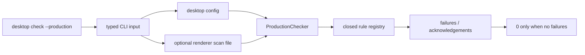

# Production security checker that fails on weakened defaults

## What we set out to do

Issue #45 asked for `desktop check --production` to fail on the fixed §14.6 production weakening list: backend imports from renderer code, raw bridge access, native host protocol access, unscoped filesystem/process/secrets policies, unsigned update install, app-protocol traversal, weakened CSP, unsafe navigation, unscoped resources, unsupported capabilities without guards, and secret-pattern redaction bypasses.

## What actually ended up working

The shipped shape matches the issue architecture: `@effect-desktop/config` owns a closed production rule set, typed reports, and acknowledgement handling; `@effect-desktop/cli` is a thin Effect adapter that loads config and optional renderer scan input, runs the checker, formats the report, and exits non-zero on failures. The main implementation shift is that CLI argument parsing became part of the security boundary: missing explicit path values are now usage errors, and absolute paths are resolved with platform-aware `node:path` APIs.

## What surfaced in review

Two review comments were addressed. One found that `--renderer --config ...` silently skipped renderer scanning because the missing renderer value collapsed to `undefined`. The other found that string-prefix path resolution broke Windows absolute and UNC paths. Both comments changed the final CLI adapter: path flags now return typed `CliUsageError` values, and resolution uses `isAbsolute` plus `resolve`.

## First-principles postmortem

The invariant is not just "the checker catches weakened defaults." The stronger invariant is "when the user asks the checker to inspect an input, that input is either inspected or the command fails." A malformed scan request is not absence of input; it is invalid input. Treating those as the same value creates a bypass in the mechanism that is supposed to prevent bypasses.

## Game-theory postmortem

The dangerous local incentive is to make CLI flags forgiving so commands keep running. That is normally convenient, but in a production security gate it rewards typos with false success. The better mechanism is fail-closed parsing: explicit scan/config flags must carry valid paths, unreadable explicit inputs must return non-zero, and every failure still flows as an Effect value that the adapter renders.

## Non-obvious lesson

For a security checker, optional input and invalid requested input must be different states. Optional renderer scanning can default to no files only when the user omitted `--renderer`; once the flag is present, a missing or unreadable path is part of the security boundary and must fail the command.

## Reproducible pattern (if any)

Model CLI security-gate inputs as typed states, not nullable strings.
Let omitted optional inputs default.
Let malformed explicit inputs return typed usage errors.
Keep the adapter responsible for rendering errors and exit codes, not for deciding that a failed read is safe to ignore.

## AGENTS.md amendment candidate (if any)

For production/security gate CLIs, distinguish omitted optional flags from malformed explicit flags and fail malformed explicit inputs non-zero. Why: a forgiving parser can turn a typo into an unscanned release artifact.

This is a proposal. Review and edit AGENTS.md yourself if you want to adopt it - `/learn` never auto-edits AGENTS.md.
