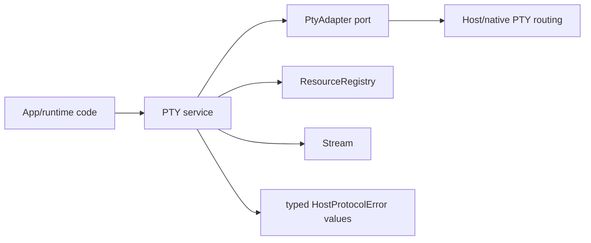

# PTY Effect service in @effect-desktop/core

## What we set out to do

Issue #125 asked for a typed `PTY` Effect service in `@effect-desktop/core` with schema-validated open/write/resize/kill operations, `Stream.Stream<Uint8Array>` output, `onExit`, permission checks, and resource registration. The planned architecture routed app code through the PTY service to host/native PTY methods backed by `crates/native-pty`, while keeping the handle bound to `ResourceRegistry` scope lifetime.

## What actually ended up working

The final service keeps the core API deep and Effect-owned: `PTY.open` validates inputs, checks `pty.spawn` permissions, reserves a per-scope PTY budget, registers a scoped resource, converts native output into an Effect stream, maps adapter failures into typed `HostProtocolError` values, and returns a handle with `write`, `resize`, `kill`, and `onExit`. The architecture changed in one important way: core does not pretend it can directly consume the Rust crate. It exposes a `PtyAdapter` port, with the native host routing left explicit for the later host-protocol integration.

## What surfaced in review

Four P1 review comments changed the final shape. Two covered lifecycle accounting: a PTY resource must be disposed and its budget released when the exit observer sees either success or failure, and a scope-close budget slot must not be released merely because `SIGTERM` was sent. Two covered long-running session safety: output budgeting must not count total lifetime bytes for a draining PTY, and disposal must escalate to `SIGKILL` if graceful shutdown does not terminate the child. All four were addressed; none were pushed back.

## First-principles postmortem

The invariant was that the registry and budget must describe live operating-system process state, not the intent to change it. Sending a signal is a request; observed process exit is the terminal fact. Treating a rejected exit promise as an exceptional side channel also broke the invariant because it skipped disposal. The service now models exit failure in the Effect error channel, observes the `Exit`, disposes in both branches, and releases the budget only after the resource disposer completes its shutdown sequence.

## Game-theory postmortem

The local incentive was to make scope close fast and mark the resource disposed once cleanup was requested. That creates a bad equilibrium: tests pass on cooperative fake children, but production accumulates orphaned PTYs and budgets undercount real work. The better mechanism is to bind accounting to observable terminal states and to make adversarial children part of the test harness. Review comments acted as pressure against the happy-path fake and forced the fake adapter to model delayed exits, rejected exits, ignored `SIGTERM`, and output beyond a small budget.

## Non-obvious lesson

For resource-owning Effect services, cleanup is not complete when the cleanup request succeeds. Cleanup is complete when the external resource has reached a terminal state or the service has made an explicit, observable decision to stop waiting. The same rule applies to budget release, registry disposal, and failure logging.

## Reproducible pattern (if any)

Use a small adapter fake that can delay exit, reject exit, ignore graceful shutdown, and emit output in multiple chunks.
Run the resource disposer through `ResourceRegistry.closeScope`, not just the direct handle method.
Assert both the external action sequence (`SIGTERM`, then `SIGKILL`) and the accounting effect (new opens respect/release budget).
Use `Effect.exit` when an observer must run cleanup on both success and failure.

## AGENTS.md amendment candidate (if any)

Effect-owned resource services should release registry entries and budgets only after observing terminal external state, with tests for rejected exit, delayed exit, and ignored graceful shutdown. Why: sending cleanup is not proof that cleanup happened.

This is a proposal. Review and edit AGENTS.md yourself if you want to adopt it — `/learn` never auto-edits AGENTS.md.
