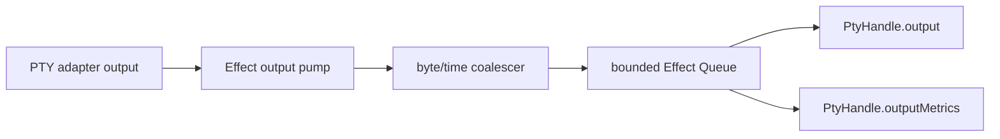

# PTY output backpressure and chunk coalescing

## What we set out to do

Issue #129 asked for PTY output to be bounded, chunk-coalesced, and observable. The target behavior was a PTY-local output buffer that batches small reads up to a time or byte window, then offers frames through a bounded queue with explicit overflow policy.

## What actually ended up working

The PTY service stayed as the policy owner. Native PTY output still crosses the adapter as `ReadableStream<Uint8Array>`, and `packages/core` wraps that stream with an Effect-owned output pump. The pump uses `Queue`, `Ref`, `Stream`, `Effect`, and child fibers to coalesce chunks, enforce byte capacity, apply `error`, `dropOldest`, `dropNewest`, or `block`, and expose handle-local output metrics. The issue diagram still describes the shape, with one concrete addition: metrics are exposed through `PtyHandle.outputMetrics` until a later devtools registry consumes them.

## What surfaced in review

No posted review threads remained. Local review before posting found two issues that changed the final branch: invalid output budget values reached queue construction instead of failing as typed `InvalidArgument`, and the first coalescer flushed on byte threshold or source completion but not when a live PTY went quiet after a small prompt. Both were fixed before the GitHub review was posted.

## First-principles postmortem

The invariant was not only bounded memory. It was bounded memory plus bounded latency plus observable loss. A coalescing window is a promise that a small chunk will not wait forever for the next chunk. Treating the time window as an optimization instead of a lifecycle transition would have broken interactive terminal prompts while still passing finite-stream tests.

## Game-theory postmortem

The local shortcut was to test finite fake streams because they are easy to collect. That rewards implementations that flush on stream completion and miss live-session behavior. The correcting mechanism was a fake output stream that stays open after emitting a small chunk, plus an Effect timeout around `Stream.take(1)`. That makes the real user-facing failure cheap to reproduce.

## Non-obvious lesson

Backpressure tests need an idle-live-producer case, not only a finite producer case. A terminal process can prove final flush behavior, but an interactive terminal proves the coalescing latency contract.

## Reproducible pattern (if any)

When adding a coalescing window, test three producers: finite burst, over-capacity burst, and quiet live stream.
Validate policy numbers before allocating queues or touching adapters.
Expose metrics from the same module that drops or evicts data.

## AGENTS.md amendment candidate (if any)

For stream coalescing, include a quiet-live-producer test in addition to finite-stream tests. Why: completion flushes can hide broken time-window latency.

This is a proposal. Review and edit AGENTS.md yourself if you want to adopt it — `/learn` never auto-edits AGENTS.md.
