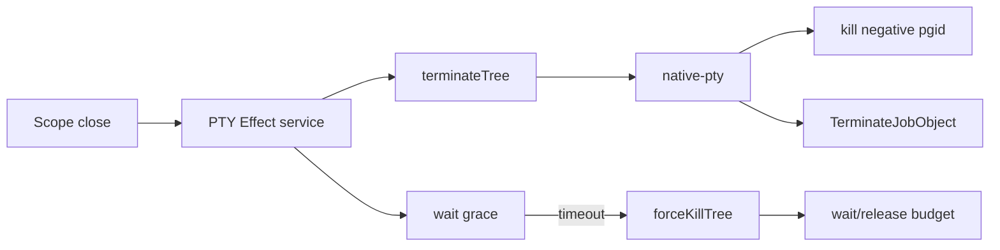

# PTY process-tree kill on close

## What we set out to do

Issue #127 asked for PTY close to terminate the whole external process tree, not only the direct shell. The intended invariant was concrete: scope close sends a graceful tree-termination request, waits, escalates to force kill, waits again, and does not release the resource/budget as if cleanup happened while descendants are still running.

## What actually ended up working

The final shape put platform cleanup in `crates/native-pty`, where it belongs. On Unix, `portable-pty` already starts the PTY child as a session leader, so `native-pty` can use the child pid as the process-group id and signal `-pgid` for `SIGTERM` and `SIGKILL`. On Windows, `native-pty` now assigns the child to a Job Object immediately after spawn and terminates that Job Object for tree cleanup. The TypeScript `PTY` service stayed as the lifecycle orchestrator: it calls `terminateTree`, waits for exit, calls `forceKillTree` on timeout, waits again, and logs `PtyForceKillTimeout` if the child remains live.

## What surfaced in review

One review finding changed the Windows implementation: `JOB_OBJECT_LIMIT_BREAKAWAY_OK` would have allowed descendants to escape the Job Object with `CREATE_BREAKAWAY_FROM_JOB`, directly weakening the no-orphan guarantee. Removing that flag made the Windows mechanism match the issue’s invariant instead of copying the host runtime’s broader breakaway policy.

## First-principles postmortem

The primitive concept is ownership of an external process family. A direct child handle is not the family; it is only one member and the reaping target. The actual ownership mechanism is the process group on Unix and the Job Object on Windows. Once that distinction is explicit, the module boundary is clear: Rust owns platform process-tree mechanics, while Effect-owned TypeScript owns scope timing, typed errors, registry disposal, and budget release.

## Game-theory postmortem

The bad local move was to reuse the closest available kill API and assume it represented tree cleanup. That move is attractive because it compiles and passes cooperative tests, but operators pay the cost as orphaned shells and background commands. The alignment mechanism was adversarial verification: tests spawn descendants, test ignored `SIGTERM`, and review checked whether Windows descendants could intentionally break away from the Job Object.

## Non-obvious lesson

Platform cleanup flags are part of the invariant, not incidental wiring. A flag like `JOB_OBJECT_LIMIT_BREAKAWAY_OK` can be correct for one owner, such as a runtime process that may need controlled child escape, and wrong for another owner, such as a PTY that promises no surviving descendants.

## Reproducible pattern (if any)

Ground upstream process-spawn behavior before adding lifecycle code.
Separate direct-child reaping from process-family termination.
Test cooperative descendants and adversarial descendants that ignore graceful shutdown.
Review platform flags against the owner’s invariant, not against a nearby module’s usage.

## AGENTS.md amendment candidate (if any)

When adding process-tree cleanup, review every platform-specific isolation flag against the resource owner’s invariant before reusing a nearby configuration. Why: copied process flags can silently invert cleanup guarantees.

This is a proposal. Review and edit AGENTS.md yourself if you want to adopt it — `/learn` never auto-edits AGENTS.md.
