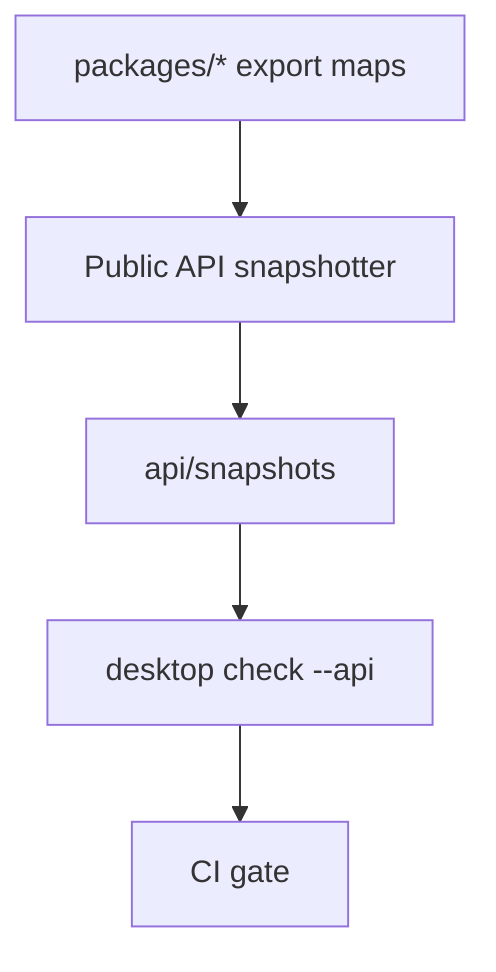

# Public API freeze checklist — snapshot every public symbol; semver guard test

## What we set out to do

Issue #120 set out to make the v1.0 public API freeze executable: every package root export should be snapshotted, accidental changes should fail CI, reviewers should see a concrete snapshot diff, and the breaking-change policy should live beside the artifacts it governs.

## What actually ended up working

The shipped design adds `desktop check --api` as a CLI-owned Effect program. It discovers package root export maps, uses the TypeScript compiler API to snapshot exported symbols, writes `api/snapshots/*.snapshot.json` in `--write` mode, and fails default check mode when the current public surface differs from the committed snapshots. CI now runs the check after the reproducibility tests, and `api/breaking-change-policy.md` explains the review rule.

## What surfaced in review

The local `/code-review` pass found one correctness issue before merge: the first snapshot implementation recorded many signatures as only the symbol name, so changing an interface body could have escaped the guard. That was addressed by recording declaration text for type/interface exports and TypeScript type signatures for value/function exports, plus a regression test for signature changes.

## First-principles postmortem

The invariant was not "there is a snapshot file." The invariant was "a public compatibility promise changes only when a reviewer can see the changed promise." A symbol-name-only snapshot protected export presence but not the shape being promised. Once that invariant was restated, the snapshot needed to include the public type/declaration shape rather than just symbol identity.

## Game-theory postmortem

Future contributors are tempted to make a small public barrel edit and rely on typecheck to prove safety. Typecheck proves the repo still compiles; it does not tell reviewers that users now have a different contract. The snapshot gate changes the payoff: the easy path is still to edit the API, but the change becomes an explicit artifact reviewed with the PR. The bad equilibrium avoided is a growing public API where accidental exports and silent signature changes accumulate until v1.0 compatibility is unknowable.

## Non-obvious lesson

API snapshots must capture the promise, not the implementation and not only the name. Function bodies are too sensitive because internal refactors should not look like API breaks, while bare symbol names are too weak because type changes can slip through. The durable middle is declaration text for type-level exports and checker-rendered type signatures for values.

## Reproducible pattern (if any)

Use compiler-owned type information for public value signatures. Use source declaration text for type/interface aliases where the declaration is the contract. Add one negative test for an added symbol and one negative test for a changed signature before trusting the snapshot format.

## AGENTS.md amendment candidate (if any)

When adding a public API snapshot, review the snapshot payload for both over-sensitivity and under-sensitivity before accepting it. Why: a snapshot that records implementation bodies creates noise, while one that records only names misses real compatibility breaks.

This is a proposal. Review and edit AGENTS.md yourself if you want to adopt it — `/learn` never auto-edits AGENTS.md.
