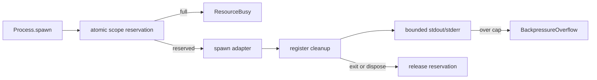

# Resource budgets (max processes per scope, max stdout/stderr buffer)

## What we set out to do

The issue asked the Process service to prevent runaway subprocess usage by enforcing a per-scope concurrent process limit and stdout/stderr byte budgets. The intended failure shape was typed, observable budget exhaustion: spawn beyond the process limit should fail instead of starting another child, and stream overflow should fail the stream rather than allowing unbounded buffering.

## What actually ended up working

The shipped shape keeps the Process service as the budget owner. `Process.spawn` validates and authorizes the input, atomically reserves one process slot for the owner scope with an Effect `Ref`, then calls the adapter and registers the resource. The slot is released from the registered cleanup path, so normal exit, explicit dispose, and scope close all free capacity. stdout and stderr streams are wrapped with cumulative byte caps that fail with `BackpressureOverflow` when the configured budget is exceeded.

## What surfaced in review

One automated review comment found the important flaw: counting live process resources from a registry snapshot before registration was not an atomic budget reservation. Parallel spawns in the same scope could observe the same count and all proceed. That comment was addressed by replacing snapshot counting with an Effect-owned `Ref.modify` reservation and adding a parallel-spawn regression test.

## First-principles postmortem

The invariant was not "the registry eventually contains no more than N process resources." The invariant was "no more than N spawn operations may pass the gate for a scope at the same time." A registry snapshot is an observation, not a reservation. Once the invariant was stated that way, the fix had to be a single atomic state transition that either increments the scope count or returns a typed refusal.

## Game-theory postmortem

The local incentive was to reuse the registry as the source of truth because it already tracked live resources. That looked minimal, but it made the enforcement mechanism depend on timing between independent fibers. The better mechanism is a gate owned by the service that benefits from the invariant: Process reserves before adapter activity and releases through cleanup. This avoids the bad equilibrium where every service reads shared state and assumes the read itself enforces policy.

## Non-obvious lesson

For resource budgets, "check then register" is not a budget. It is telemetry with a race. The enforcement point must own an atomic reservation primitive, and cleanup must release the reservation through the same lifecycle path that owns the resource.

## Reproducible pattern (if any)

When an Effect service enforces a capacity limit, model capacity as an Effect primitive (`Ref`, queue, semaphore, or scoped acquisition), not as a derived count from an eventually updated registry.

Map budget refusals into the existing closed protocol error union unless the bridge protocol itself is intentionally being revised.

Add at least one parallel/forked regression test for every capacity gate.

## AGENTS.md amendment candidate (if any)

For budget or capacity enforcement, require an atomic Effect-owned reservation primitive and a parallel regression test. Why: snapshot reads do not enforce limits under concurrent fibers.

This is a proposal. Review and edit AGENTS.md yourself if you want to adopt it — `/learn` never auto-edits AGENTS.md.
