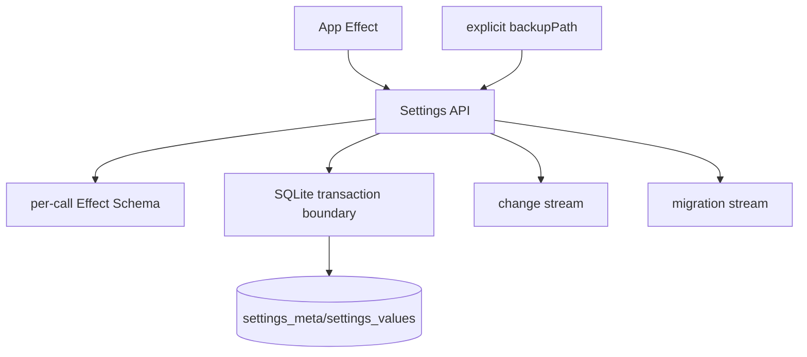

# Settings service — typed schema-validated key/value store on top of SQLite

## What we set out to do

Phase 14 needed a typed Settings store over SQLite so apps stop hand-rolling JSON
files. The service had to validate values with Effect Schema, provide defaults,
serialize read-modify-write updates, run schema migrations in one transaction,
emit change and migration streams, and recover a corrupt database from an
explicit backup.

## What actually ended up working

The final module is a narrow Settings API backed by the SQLite service:
`open`, `get`, `getOrDefault`, `set`, `update`, `changes`, `migrated`, and
`close`. Settings owns the `settings_meta` and `settings_values` tables,
schema-version metadata, JSON encoding boundary, migration transaction, and
PubSub streams. The original architecture described a registered schema per
namespace, but the implementation kept schemas at each call site. That made the
module smaller and kept the validation contract explicit where values cross the
API boundary.

## What surfaced in review

There were no PR review comments or issue comments on #215. The relevant
feedback loop was local verification plus Blacksmith CI on Ubuntu, Windows, and
macOS. The main design adjustment happened before PR creation: the recovery
path stayed explicit through `backupPath` instead of adding a speculative backup
rotation manager.

## First-principles postmortem

The invariant that mattered most was "one setting update has one serialized
timeline." SQLite already owns the serialization primitive, so Settings should
not invent a second lock. `update` uses `connection.transaction`, while `set`
remains last-writer-wins. The other invariant was "decode at the boundary";
stored JSON is untrusted even when this process wrote it, so every `get` decodes
through the caller's schema and returns `InvalidArgument` as a typed Effect
failure.

## Game-theory postmortem

The bad equilibrium is each app author creating a convenient JSON file with no
migration or concurrency story. Once that exists, every app has an incentive to
patch its own edge cases locally, and the framework loses a coherent storage
contract. Centralizing Settings changes the incentive: app code only supplies a
schema, version, and migration, while the runtime owns transactions and typed
failure. The missing information early was how recovery should discover backups;
making `backupPath` explicit avoided pretending that rotation policy existed.

## Non-obvious lesson

Corrupt recovery is only as real as the error classifier beneath it. The Settings
test corrupted a database with arbitrary bytes, and Bun/SQLite surfaced that as
`SQLITE_NOTADB`, not only `SQLITE_CORRUPT`. A higher-level recovery module cannot
be correct if the lower-level adapter classifies one real corrupt-file mode as a
generic I/O or invalid-state failure.

## Reproducible pattern (if any)

When a runtime service claims to recover from a lower-level failure, write the
test by damaging the real substrate, not by injecting the expected tag. Then
extend the adapter classifier until the service sees the domain failure it can
handle.

## AGENTS.md amendment candidate (if any)

None.

This is a proposal. Review and edit AGENTS.md yourself if you want to adopt it —
`/learn` never auto-edits AGENTS.md.
