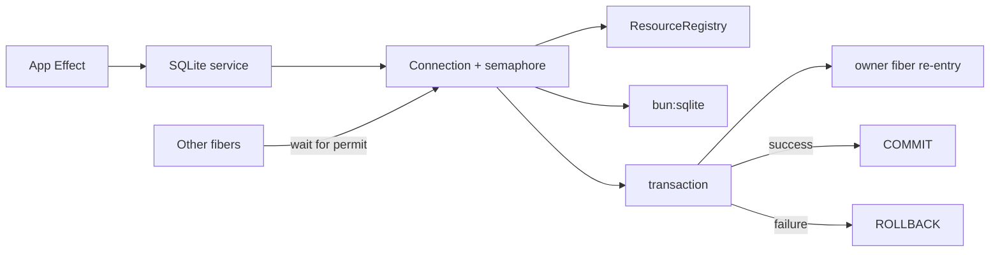

# SQLite service via bun:sqlite

## What we set out to do

Phase 14 needed a typed `SQLite` Effect service over `bun:sqlite` so apps stop
opening databases directly. The planned surface was scope-bound connections,
`query`, `exec`, prepared statements, transactions as Effects, and typed
`SqliteError` tags for driver failures.

## What actually ended up working

The final module matches the issue shape: `makeSQLite` and `SQLiteLive` hide
`bun:sqlite`, register connections and prepared statements in `ResourceRegistry`,
map driver codes into typed `Data.TaggedError` values, and expose `query`,
`exec`, `prepare`, and `transaction`. The implementation added one important
mechanism not explicit in the issue: every connection owns a `Semaphore`, and a
transaction records its owner fiber so only that fiber can re-enter connection
methods while the transaction holds the permit.

## What surfaced in review

One review thread was addressed. The initial implementation used a shared
`transactionActive` flag to avoid deadlocking when transaction effects called
`connection.exec` or prepared statements. That fixed same-fiber re-entry but let
other fibers bypass the connection semaphore during the open transaction. The
final version tracks the transaction owner fiber id and includes a regression
proving outside fibers wait until commit/rollback.

## First-principles postmortem

The invariant was not merely "transactions must not deadlock"; it was "one
connection has one writer timeline." SQLite transactions are temporal state on a
connection, so the lock must protect the whole transaction interval, while still
allowing the transaction's own Effect to call the public connection methods. The
assumption that a boolean transaction flag was enough was wrong because it did
not encode ownership.

## Game-theory postmortem

The app author wants the ergonomic path: call `connection.exec` inside
`connection.transaction`. The operator wants isolation: unrelated calls must not
silently join that transaction. A global "transaction active" flag rewards local
ergonomics at the cost of cross-fiber leakage. The owner-fiber guard aligns both
players: transaction code can reuse the same public API, but other fibers still
pay the semaphore wait and cannot accidentally commit work in another request's
transaction.

## Non-obvious lesson

Reentrancy is an ownership problem, not a boolean state problem. If a lock is
held across an Effect and the Effect must call back into the locked API, the
bypass must prove the caller is the owner of that lock. Otherwise the bypass
turns isolation into ambient mutable state.

## Reproducible pattern (if any)

For Effect services that expose transactions or long critical sections:

1. Protect the resource with a semaphore.
2. Record the owner fiber for the critical section.
3. Let only that owner re-enter without taking the semaphore.
4. Add a test where a non-owner fiber tries to use the resource before release.

## AGENTS.md amendment candidate (if any)

When adding reentrant critical sections in Effect-owned code, include an
outside-fiber contention test. Why: same-fiber success proves ergonomics, but
only a non-owner test proves isolation.

This is a proposal. Review and edit AGENTS.md yourself if you want to adopt it
— `/learn` never auto-edits AGENTS.md.
