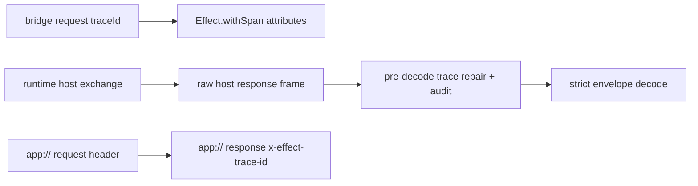

# Trace identity and propagation wired through the bridge

## What we set out to do

The issue asked for trace identity to survive framework-owned process boundaries: renderer bridge calls, runtime host-protocol envelopes, worker inheritance, `app://` responses, and allowlisted outbound telemetry. The important failure mode was a missing host-protocol `traceId`: it must be repaired and audited, not rejected silently or allowed to break correlation.

## What actually ended up working

The strict host-protocol schema already required `traceId`, so missing-trace recovery could not live behind normal envelope decoding. The working design repairs raw host response frames before strict decode, emits `audit/trace-id-missing`, and maps audit-write failures back into the host exchange's typed `HostProtocolError` channel. Bridge dispatch now wraps handler execution in `Effect.withSpan` with the request trace attributes, and the native `app://` protocol echoes `x-effect-trace-id` or mints one for the response header.

## What surfaced in review

No PR review comments were posted before merge. Local typecheck served as the review pressure: the first version leaked `EventLogError` through `HostHandshakeExchange`, which would have widened a closed adapter contract. The fix kept audit failures typed but translated them at the boundary into `HostProtocolInvalidOutputError`.

## First-principles postmortem

The invariant was simple: every decoded protocol envelope must have a trace ID, and every missing ID must become observable. Because decode itself enforces the invariant, recovery has to happen before decode. The source of truth is the boundary frame or request header, not a partially decoded object.

## Game-theory postmortem

The bad local incentive is to add a fallback wherever a caller wants a `traceId`, because that makes the immediate code pass while hiding trace loss. The better mechanism is boundary ownership: the adapter that first observes untrusted input either extracts a trace ID, mints one, or emits an audit row. That makes missing identity visible once, at the place with the most information, instead of letting each subsystem invent its own correlation story.

## Non-obvious lesson

Strict schemas and recovery logic have an ordering constraint. If a required field is absent, any recovery placed behind schema decoding is dead code; repair must happen on the raw transport representation, then strict decoding can remain uncompromised.

## Reproducible pattern (if any)

For required cross-boundary metadata, repair at the raw adapter boundary.
Emit one audit row at the recovery point.
Keep the public decoded model strict.
Translate lower-level audit/storage failures into the adapter's existing typed error channel.

## AGENTS.md amendment candidate (if any)

When adding recovery for required protocol metadata, place recovery before strict schema decode; Why: post-decode recovery cannot execute when the schema correctly rejects the missing field.

This is a proposal. Review and edit AGENTS.md yourself if you want to adopt it - `/learn` never auto-edits AGENTS.md.
