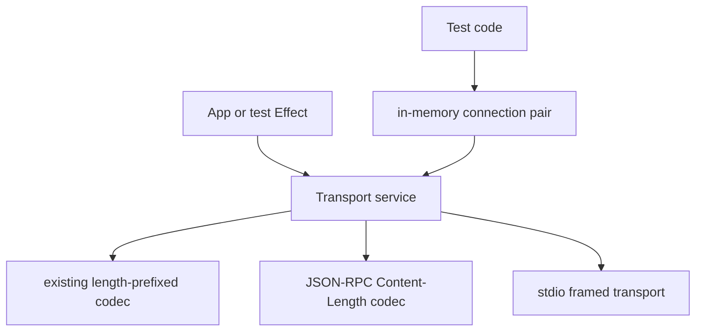

# Transport runtime service — abstract over host protocol transport for tests

## What we set out to do

The issue asked for an Effect-owned `Transport` runtime service so app-owned protocols and tests do not reach into raw host transport internals. The intended surface included shared framing helpers, typed errors, deterministic cleanup, and a substitutable fake for tests.

## What actually ended up working

The shipped implementation deepens the existing `packages/core/src/runtime/transport.ts` module instead of adding a parallel wrapper. The old pure host framing helpers remain the compatibility source of truth, while the new `Transport` service exposes typed `frame`, `unframe`, `unframeStream`, and `connect` operations. It adds JSON-RPC `Content-Length` framing, Effect-native typed transport errors, an in-memory connection pair for tests, and close semantics on framed transports.

## What surfaced in review

Review produced three addressable comments and no pushbacks. Two P1 findings changed the final design: span attributes could not read undecoded input because malformed untyped calls must return `TransportInvalidArgumentError`, and `close()` needed real semantics instead of `Effect.void`. One P2 finding changed error classification: malformed JSON-RPC headers now report the `header` field instead of blaming `maxFrameBytes`.

## First-principles postmortem

The invariant was not "there is a Transport service"; it was "raw bytes cross a narrow boundary with typed framing, typed failure, and explicit lifetime." A service that only forwarded `send` and `recv` would have been shallow. The useful abstraction hides the volatile parts: frame parsing, malformed input classification, stream decoding state, and test substitution.

## Game-theory postmortem

The local shortcut was to wrap existing Promise-shaped transport code and call it done. That makes the PR small but leaves future tests and app protocols with the same cleanup ambiguity and untyped edge cases. The review mechanism shifted incentives back to the global goal: if the module owns transport, it must also own malformed boundary input, receive termination, and diagnostic field accuracy.

## Non-obvious lesson

Trace and span metadata are part of the boundary. If metadata reads fields before schema decoding, an observability improvement becomes an untyped throw path. In Effect-owned services, decode first, then derive attributes from decoded values, or omit attributes when the input may be malformed.

## Reproducible pattern (if any)

For Effect service boundaries:

1. Accept unknown-shaped runtime input defensively even when TypeScript types look strict.
2. Decode before reading fields for spans, logs, metrics, or branching.
3. Keep close semantics testable; `close: Effect.void` is only valid for handles with no blocked producer or external resource.
4. Map malformed remote protocol data to the protocol field, not to a local option with a similar parser.

## AGENTS.md amendment candidate (if any)

For Effect service boundary spans, never read input fields for attributes before schema decoding. Why: observability must not create an untyped failure path.

This is a proposal. Review and edit AGENTS.md yourself if you want to adopt it — `/learn` never auto-edits AGENTS.md.
