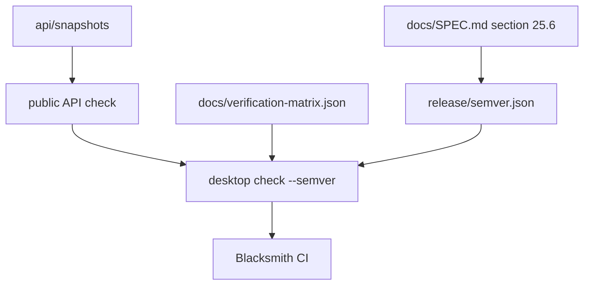

# Versioning policy compliance test

## What we set out to do

The goal was to make the §25.6 stability contract observable in CI: patch releases must be bug-fix only, minor releases additive only, major releases may break, Appendix C release rows must remain covered, deprecations must retain a three-minor-release posture, and bridge envelope policy must stay explicit.

## What actually ended up working

The shipped gate reuses the existing public API snapshot engine instead of inventing a second scanner. `desktop check --semver` reads `release/semver.json`, validates the spec sources and Appendix C rows, captures public API snapshot mismatches as typed Effect values, classifies each API change as additive or breaking, and applies release-kind policy before returning a `SemverGuardReport` or `SemverGuardPolicyError`.

## What surfaced in review

Two review comments changed the final design. The first caught that additive changes were allowed for patch releases, even though patch releases must be bug-fix only. The second caught that `releaseKind` was trusted instead of derived from the semantic version string, allowing a manifest to mislabel `1.1.1` as `minor` and weaken enforcement. Both were addressed with typed guard failures and regression tests.

## First-principles postmortem

The invariant is not "additive is safe"; it is "the change set is allowed by this release number." Additive public API changes are safe for a minor release and unsafe for a patch release. Once the gate used that invariant, `releaseKind` became derived policy, not user-controlled policy. The manifest can record intent, but the version number is the source of truth for whether the gate allows additions, removals, or signature changes.

## Game-theory postmortem

The local incentive is to mark a release as whatever makes CI pass. If CI trusts that label, a future engineer can accidentally or deliberately downgrade enforcement by editing one manifest field. Deriving `releaseKind` from `X.Y.Z` removes that incentive. The mechanism that aligned behavior was turning policy into a classifier with typed failure values: every forbidden change produces an explicit report, and the review could challenge the policy table directly instead of inferring behavior from CLI output.

## Non-obvious lesson

Semver gates should classify against the release number, not against an abstract "additive versus breaking" pass condition. Additive is a classification, not a verdict. The verdict only exists after combining the classification with patch/minor/major policy.

## Reproducible pattern (if any)

When a manifest has both a human label and a structured value, derive enforcement from the structured value.
Keep the label as a consistency check.
Make the mismatch a typed error.
Test the policy boundary that a reviewer would use to bypass the gate.

## AGENTS.md amendment candidate (if any)

For release gates, derive enforcement from canonical structured data rather than manifest labels. Why: labels are easy to misstate, while canonical values make bypasses reviewable and testable.

This is a proposal. Review and edit AGENTS.md yourself if you want to adopt it — `/learn` never auto-edits AGENTS.md.
