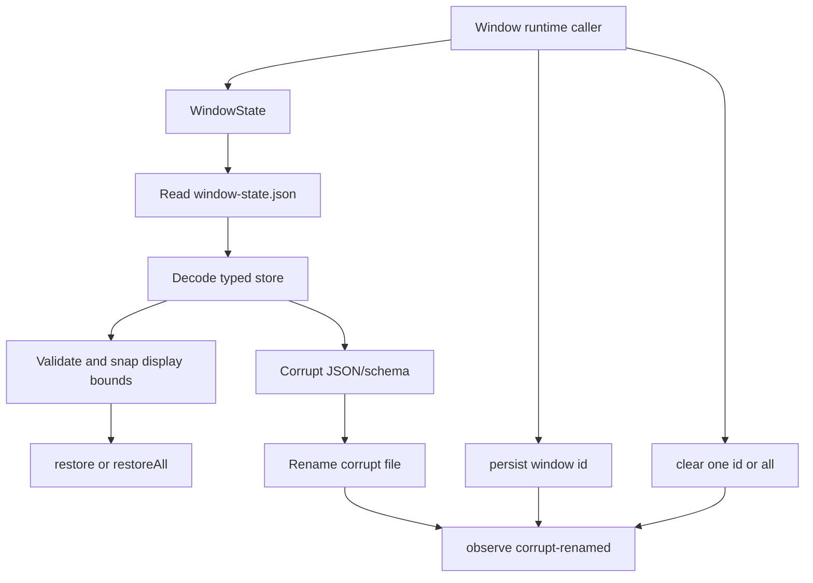

# WindowState deepening - persist + restore across launches

## What we set out to do

Issue #142 asked `WindowState` to move from a narrow per-window storage primitive to a cross-launch runtime contract: restore all persisted windows independently, snap off-screen windows back onto a visible display, clear stale records, and expose corrupt-file recovery as an observable event while keeping failures typed in the Effect error channel.

## What actually ended up working

The existing module was deep enough to extend in place. The shipped shape keeps platform-path resolution, schema decoding, corrupt-file rotation, and temp-file rename inside `WindowState`, then adds `restoreAll`, `clear`, `observe`, `WindowDisplayBounds`, and `WindowStateEvent`. Off-screen correction is applied after caller-provided validation and before records leave the service, so callers get a restore-ready record without owning display math. Corrupt JSON still recovers to an empty store, but now returns a `corrupt-renamed` event that `observe()` publishes instead of hiding the recovery side effect.

## What surfaced in review

There were no PR review comments for this cycle because external reviews were disabled before merge. Local typed lint still surfaced one correctness issue: spreading an Effect Schema class instance into a new record would lose the class prototype. The fix was to copy `WindowStateRecord` fields explicitly when snapping a record to a display.

## First-principles postmortem

The invariant that mattered most was keeping restore policy inside the state owner. Window callers should not need to know which JSON failures recover, how corrupt files are renamed, or how display rectangles intersect. Once that boundary is owned by `WindowState`, the interface can stay small while the implementation absorbs the cross-launch details.

## Game-theory postmortem

The local incentive was to ship only the missing methods and trust callers to wire audit, display checks, and cleanup later. That would produce a bad equilibrium where every window lifecycle caller grows partial restore policy and each one fails differently. The better mechanism is a deep service boundary: one owner for file recovery, display sanity, event publication, and typed errors.

## Non-obvious lesson

Class-backed schema values are still values with prototypes. Object spread looks like harmless data copying, but in strict typed-lint it is a signal that the code is turning a validated domain value into a plain object. When rebuilding schema class instances, copy explicit fields so the domain type remains intentional and the optional-field semantics stay visible.

## Reproducible pattern (if any)

When a runtime service restores durable state, make the service return restore-ready data.
Apply caller extension hooks first, then enforce service-owned safety checks before returning.
If recovery performs a side effect, emit a typed event from the same Effect path.
When rebuilding schema class records, copy fields explicitly instead of spreading instances.

## AGENTS.md amendment candidate (if any)

When rebuilding `Schema.Class` values, copy fields explicitly instead of spreading class instances. Why: spread drops prototypes and can hide optional-field semantics from typed lint.

This is a proposal. Review and edit AGENTS.md yourself if you want to adopt it - `/learn` never auto-edits AGENTS.md.
