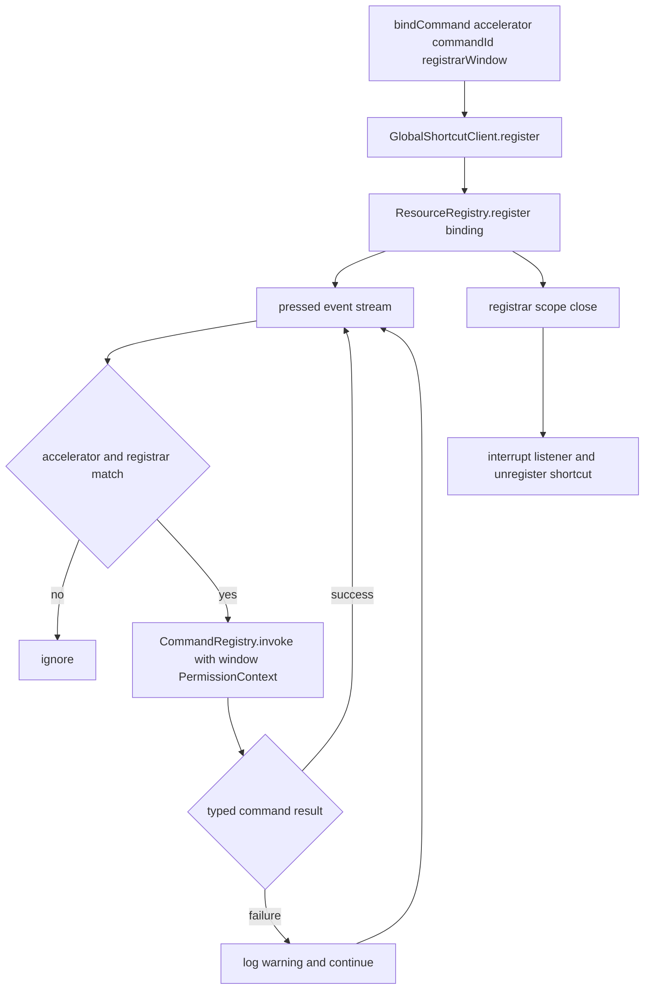

# Wire GlobalShortcut to invoke CommandRegistry with the registered command id

## What we set out to do

The issue asked for `GlobalShortcut` to stop exposing a free-form callback path and instead bind an accelerator to a registered command id. The important invariant was that shortcut presses must use the same `CommandRegistry.invoke` path as other command surfaces, with the registrar window owning both permission authority and cleanup.

## What actually ended up working

The shipped shape keeps the native shortcut client as a port and adds `GlobalShortcut.bindCommand(accelerator, commandId, registrarWindow)`. The registrar window is intentionally explicit because `CommandRegistry.invoke` requires a `PermissionContext`; deriving the actor from the registrar window avoids a hidden ambient authority source. Press events are filtered by accelerator and `registrarWindowId`, then each matching event invokes the command through `CommandRegistry`. The binding registers a `global-shortcut-command` resource under the registrar window scope, and scope close interrupts the listener and unregisters the OS shortcut.

## What surfaced in review

Two review threads, one automated and one local, found the same lifecycle bug: a `CommandRegistry.invoke` failure inside the detached listener could terminate the whole shortcut subscription while leaving the OS shortcut registered. Both comments were addressed. The fix moved command invocation into a per-press helper that catches `CommandRegistryError`, logs it as an observable typed failure, and keeps the stream alive.

## First-principles postmortem

The core invariant is that a shortcut binding is a long-lived resource, while a command invocation is a single event. Those lifetimes must not be complected. A single failed command execution can be important signal, but it is not the same thing as deciding the binding should stop receiving future presses. The missing distinction was between resource failure and event failure.

## Game-theory postmortem

The dangerous local move was easy: return the command invocation effect directly from `Stream.runForEach`. That is locally clean, but it lets a tired caller, a revoked permission, or a transient handler failure disable future shortcut presses without visible state. The better mechanism makes the failure observable at the event boundary and preserves the binding lifecycle until the owning scope closes.

## Non-obvious lesson

Detached Effect fibers need a deliberate error policy at the event boundary. Returning a typed failure from a per-event handler is correct for request/response code, but in a long-lived subscription it silently changes lifecycle semantics by failing the fiber. The subscription should decide whether an event failure is logged, audited, retried, or escalated; it should not inherit the event effect's failure channel by accident.

## Reproducible pattern (if any)

For long-lived streams:

1. Separate resource lifecycle failures from per-event handler failures.
2. Catch typed per-event failures inside `Stream.runForEach` when the stream must continue.
3. Log or audit the typed value so the failure is not swallowed.
4. Test a failing event followed by a successful event.

## AGENTS.md amendment candidate (if any)

In Effect-owned long-lived streams, define an explicit per-event failure policy before detaching or scoping the fiber. Why: otherwise a typed event failure can accidentally become a hidden resource lifecycle failure.

This is a proposal. Review and edit AGENTS.md yourself if you want to adopt it -- `/learn` never auto-edits AGENTS.md.
