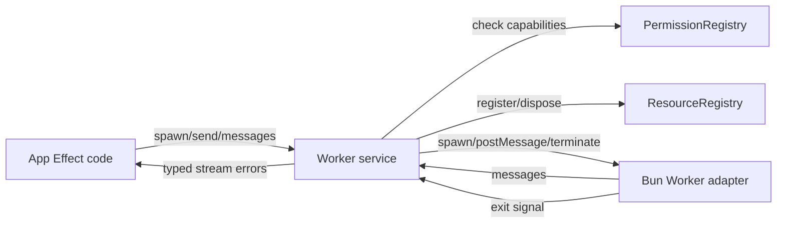

# Worker service: Bun worker spawn with typed message channel and scope-bound lifecycle

## What we set out to do

Phase 18 needed a `Worker` runtime service that makes isolated TypeScript work as ergonomic as raw `new Worker(...)` while preserving framework invariants: typed channels, explicit capability declarations, per-scope concurrency budgets, and scope-bound cleanup through `ResourceRegistry`.

## What actually ended up working

The shipped shape stayed close to the issue architecture: `Worker.spawn` owns capability checks, adapter spawn, schema validation, budget reservation, and resource registration behind one Effect service. The important implementation shift was adding a runtime `exit` signal to the adapter contract. That signal lets the service dispose the registered resource and release budget when a worker exits by itself, not only when a caller explicitly closes the handle.

## What surfaced in review

The local `/code-review` pass caught that `WorkerCrashed` defined a `resourceId`, but adapter-originated crashes still carried `Option.none` after registration made the id available. The external Codex review then caught two lifecycle bugs: worker self-exit could leak the resource and budget reservation, and shutdown always slept the full grace period even when the worker exited immediately. All three findings were addressed.

## First-principles postmortem

The invariant was not "the handle can close the worker"; it was "worker lifetime and budget ownership follow the actual runtime lifecycle." A scoped handle is only a command surface. The worker can also terminate independently, so the adapter must expose an explicit exit fact that the service can compose into cleanup.

## Game-theory postmortem

Without an exit signal, the easy local implementation is to clean up only when callers remember to close. That creates a bad equilibrium where app authors pay hidden budget leaks later, and reviewers must reason from convention rather than a visible lifecycle contract. Making `exit` part of `WorkerRuntime` changes the payoff: adapter authors have one required lifecycle fact to provide, and the service can enforce cleanup mechanically.

## Non-obvious lesson

For supervised resources, `dispose` is not a substitute for `exit`. `dispose` models requested shutdown; `exit` models observed termination. A deep runtime module needs both, because cleanup must happen when either side ends the lifecycle.

## Reproducible pattern (if any)

Ports for long-lived runtime resources should expose:

- command effects for caller-requested operations;
- stream effects for produced data;
- an `exit` effect for observed lifecycle termination;
- a `shutdown` effect for scoped disposal.

## AGENTS.md amendment candidate (if any)

For long-lived runtime adapters, require an explicit observed-exit effect distinct from disposal. Why: scope cleanup must release resources and budgets when the external runtime exits independently of caller-requested shutdown.

This is a proposal. Review and edit AGENTS.md yourself if you want to adopt it — `/learn` never auto-edits AGENTS.md.
