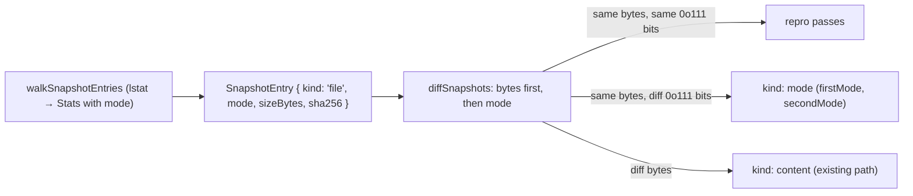

# Compare executable modes in repro checks — zero-syscall scope discipline

## What we set out to do

`desktop check --repro` treated two passes producing the same file bytes as reproducible, even when executable permission bits differed between passes. A host binary at `0o755` on one pass and `0o644` on the second pass — identical bytes, different launch semantics — would silently pass the gate. Issue #504 closed that gap by extending the snapshot model to record file mode and compare executable bits alongside content hashes.

## What actually ended up working

The issue module table named `digestFile` as the locus of mode capture. The implementation instead extended the existing `walkSnapshotEntries` to record `mode: Number(childStat.mode)` on the `SnapshotEntry["file"]` variant — mode is available for free from the `lstat` call the walker was already making, so no new function boundary or I/O was needed. `diffSnapshots` gains a `kind: "mode"` branch that fires only when sha256 matches but `(firstEntry.mode & 0o111) !== (secondEntry.mode & 0o111)`. The discriminated `SnapshotEntry` union from #503 (file | symlink) made adding `mode` to the file variant a single-point change in the type and one line in the walker.

## What surfaced in review

Zero review threads. `/code-review` produced no findings. No review-driven changes.

## First-principles postmortem

The original checker assumed "same bytes = same artifact." That assumption is wrong for deployment artifacts because the filesystem stores execution semantics alongside content: a file at `0o755` and a file at `0o644` with identical bytes are different from a deployment perspective — one can be directly invoked, the other cannot. The #503 seam paid forward: because `SnapshotEntry` already distinguishes `file` from `symlink` (symlinks have no mode), the file variant was the natural and only place to add `mode`. No other code path needed to change.

## Game-theory postmortem

The release engineer trusts `check --repro` before publishing. If the gate only hashes bytes, a build pipeline that non-deterministically sets execute bits produces a false-green — the engineer ships without knowing that one pass produces a binary that can't be launched directly. Making mode drift a named, reported difference closes that information gap at the same tool boundary where byte drift is already reported.

## Non-obvious lesson

The scope decision is `& 0o111`, not `& 0o7777`. Full mode comparison would catch setuid, setgid, sticky, and all rwx combinations — but most of those don't affect whether a packaged artifact can be invoked in a standard deployment. Executable bits are the ones that change launch behavior. Narrowing to `0o111` is correct scope: it catches the failure mode the issue identified (a binary that can't be executed after installation) without creating false positives from mode bits that don't affect execution. If the repo ever needs to track setuid drift or other mode metadata, a separate `kind: "permissions"` difference would be the right extension point — not broadening the `0o111` mask.

## Reproducible pattern

When extending a snapshot model with new metadata:

1. Check whether the metadata is already available in a syscall the walker already makes — `Stats` from `lstat` carries mode, size, mtime, uid/gid, and more at zero marginal cost.
2. Scope the comparison to the bits with semantic meaning for the artifact's deployment context — not all bits, only the ones that affect observable behavior.
3. Add the field to the discriminated union variant that owns it (here: `file`, not `symlink`). If the union is well-shaped, this is a single-point change.
4. Add `kind-specific` rendering in `formatDifference` so human output stays actionable.

## AGENTS.md amendment candidate

When adding metadata to a snapshot model, prefer metadata already present in existing lstat/stat results (free) over new I/O, and scope comparisons to bits with deployment-visible semantics rather than full mode equality. Why: zero-syscall extensions keep the gate fast; over-broad comparisons create false positives that erode trust in the gate.

This is a proposal. Review and edit AGENTS.md yourself if you want to adopt it — `/learn` never auto-edits AGENTS.md.
